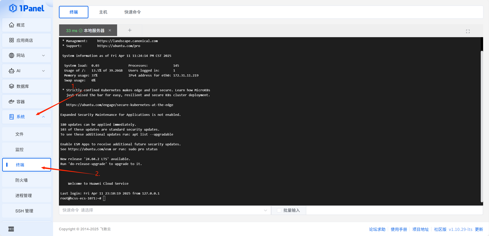
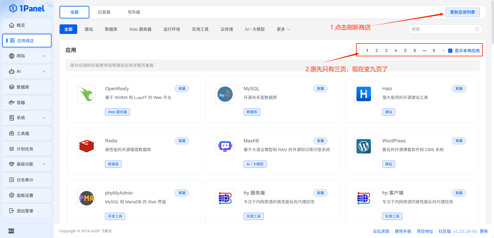
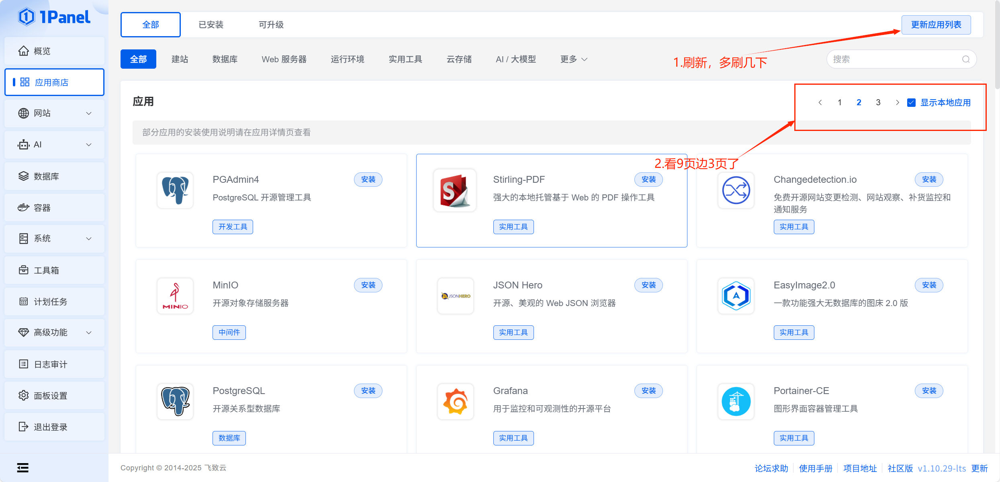

***我知道你很苦恼官方商店应用太少，没关系现在来装第三方商店***
1.打开1panel的终端，或者你的远程Shell软件，然后输入以下命令



```bash
git clone -b localApps https://github.com/okxlin/appstore /opt/1panel/resource/apps/local/appstore-localApps

cp -rf /opt/1panel/resource/apps/local/appstore-localApps/apps/* /opt/1panel/resource/apps/local/

rm -rf /opt/1panel/resource/apps/local/appstore-localApps
```

2.成功后就回到应用商店刷新，你就会发现3页变9页




3.然后有的孩子喜欢折腾，想要删除第三方商店，没关系来来来
 - 选择系统打开文件
 - 找到路径/opt/1panel/resource/apps/local
 - 删除local文件里的所有东西
  
 - 然后返回应用商店，多刷新几次就变回来了
  


*****