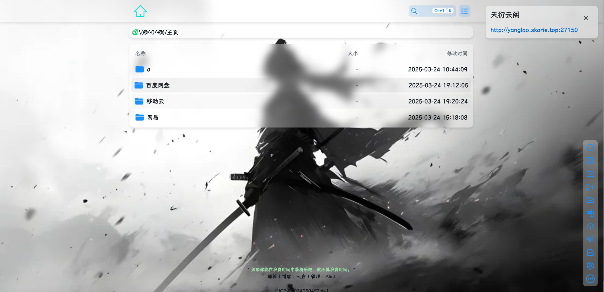
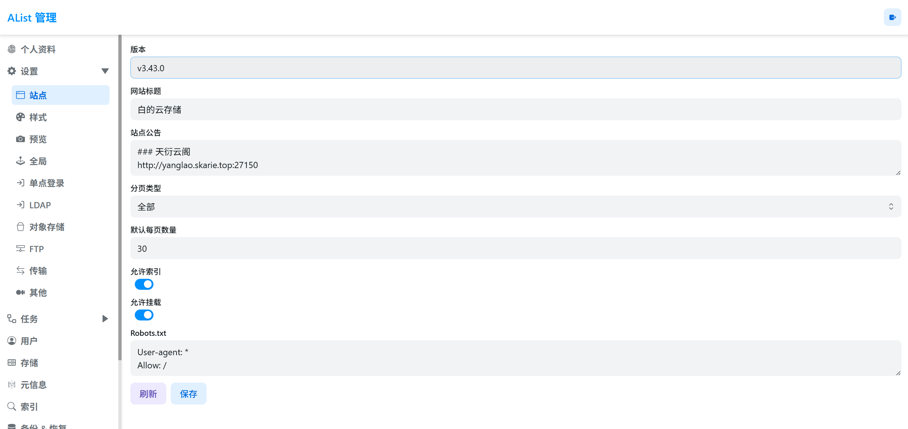
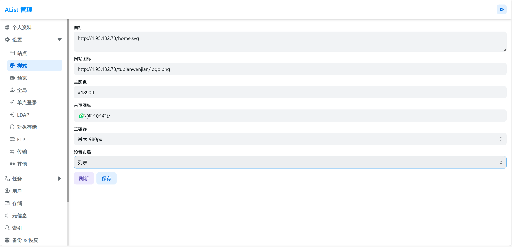
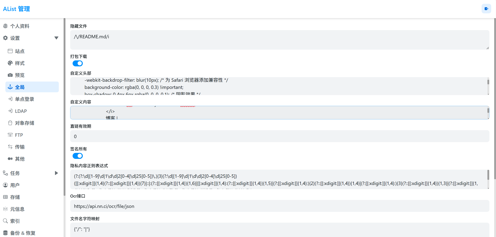

# Alist美化 
废话不说开始图文教程
_最终效果如下：_

**1.首先在设置菜单下的站点**

- 网站标题
~~顶端标签页名字（没啥好说）~~
- 站点公告
  就你进来看到右上角的内个
- 索引
  没玩明白，但是打开顶端会有搜索框 
**2.设置菜单下子选项样式**

- 图标
  这个就支持链接形式，效果也就是顶端内个绿色的房子图标
- 网站图标
就就标签页的图标
- 首页图标
  划重点！！！
  Σ(っ °Д °;)っ
  仅仅支持插入文本和文本表情哦
**3.全局**  **```!!!重点！！！```**
    
- 自定义头部
 ```css
 <!-- 引入 polyfill -->
<script src="https://polyfill.alicdn.com/v3/polyfill.min.js?features=String.prototype.replaceAll"></script>

<!-- 引入字体 -->
<link rel="stylesheet" href="https://npm.elemecdn.com/lxgw-wenkai-webfont@1.1.0/lxgwwenkai-regular.css" />

<style>
    /* 隐藏底部 */
    .footer {
        display: none !important;
    }

    /* 背景设置 */
    .hope-ui-dark, .hope-ui-light {
        background-image: url('https://haowallpaper.com/link/common/file/previewFileImg/15942630369381760') !important;
        background-size: cover;
        background-attachment: fixed;
        background-position: center;
    }
    
    /*主列表白天模式透明*/
    .obj-box.hope-stack.hope-c-dhzjXW.hope-c-PJLV.hope-c-PJLV-igScBhH-css {
        backdrop-filter: blur(10px); /* 毛玻璃效果的强度 */
        -webkit-backdrop-filter: blur(10px); /* 为 Safari 浏览器添加兼容性 */
        background-color: rgba(255, 255, 255, 0.3) !important;
        box-shadow: 0 4px 6px rgba(0, 0, 0, 0.1); /* 阴影效果 */
    }
    /*主列表夜间模式透明*/
    .obj-box.hope-stack.hope-c-dhzjXW.hope-c-PJLV.hope-c-PJLV-iigjoxS-css {
        backdrop-filter: blur(10px); /* 毛玻璃效果的强度 */
        -webkit-backdrop-filter: blur(10px); /* 为 Safari 浏览器添加兼容性 */
        background-color: rgba(0, 0, 0, 0.3) !important;
        box-shadow: 0 4px 6px rgba(0, 0, 0, 0.1); /* 阴影效果 */
    }
    /*readme白天模式透明*/
    .hope-c-PJLV.hope-c-PJLV-ikSuVsl-css {
        backdrop-filter: blur(10px); /* 毛玻璃效果的强度 */
        -webkit-backdrop-filter: blur(10px); /* 为 Safari 浏览器添加兼容性 */
        background-color: rgba(255, 255, 255, 0.3) !important;
        box-shadow: 0 4px 6px rgba(0, 0, 0, 0.1); /* 阴影效果 */
    }
    /*readme夜间模式透明*/
    .hope-c-PJLV.hope-c-PJLV-iiuDLME-css {
        backdrop-filter: blur(10px); /* 毛玻璃效果的强度 */
        -webkit-backdrop-filter: blur(10px); /* 为 Safari 浏览器添加兼容性 */
        background-color: rgba(0, 0, 0, 0.3) !important;
        box-shadow: 0 4px 6px rgba(0, 0, 0, 0.1); /* 阴影效果 */
    }

    /*顶部*/
    #root > .header {
        backdrop-filter: blur(10px); /* 毛玻璃效果的强度 */
        -webkit-backdrop-filter: blur(10px); /* 为 Safari 浏览器添加兼容性 */
        background: rgba(255, 255, 255, 0); /* 透明背景色 */
        box-shadow: 0 4px 6px rgba(0, 0, 0, 0.1); /* 阴影效果 */
    }

    /*导航条*/
    /*白天模式*/
    .hope-ui-light .body > .nav {
        background-color: rgba(255, 255, 255, 0.3);
        border-radius: var(--hope-radii-xl);
        box-shadow: 0 4px 6px rgba(0, 0, 0, 0.1); /* 阴影效果 */
    }
    /*夜间模式*/
    .hope-ui-dark .body > .nav {
        background-color: rgba(0, 0, 0, 0.3);
        border-radius: var(--hope-radii-xl);
        box-shadow: 0 4px 6px rgba(0, 0, 0, 0.1); /* 阴影效果 */
    }
   
    /*隐藏导航条遮罩*/
    .body > .nav::after {
        display: none;
    }

    /*右上视图切换菜单*/
    /*白天模式*/
    .hope-ui-light .hope-c-PJLV-iSMXDf-css {
        backdrop-filter: blur(10px); /* 毛玻璃效果的强度 */
        -webkit-backdrop-filter: blur(10px); /* 为 Safari 浏览器添加兼容性 */
        background: rgba(255, 255, 255, 0.3); /* 透明背景色 */
        border-radius: 10px;
        box-shadow: 0 4px 6px rgba(0, 0, 0, 0.1); /* 阴影效果 */
    }
    /*夜间模式*/
    .hope-ui-dark .hope-c-PJLV-iSMXDf-css {
        backdrop-filter: blur(10px); /* 毛玻璃效果的强度 */
        -webkit-backdrop-filter: blur(10px); /* 为 Safari 浏览器添加兼容性 */
        background: rgba(0, 0, 0, 0.3); /* 透明背景色 */
        border-radius: var(--hope-radii-xl);
        box-shadow: 0 4px 6px rgba(0, 0, 0, 0.1); /* 阴影效果 */
    }

    /*右下角侧边栏按钮透明 第一个是白天 第二个是夜间*/
    .hope-ui-light .hope-c-PJLV-ijgzmFG-css {
        backdrop-filter: blur(10px); /* 毛玻璃效果的强度 */
        -webkit-backdrop-filter: blur(10px); /* 为 Safari 浏览器添加兼容性 */
        background-color: rgba(255, 255, 255, 0.3) !important;
    }
    .hope-ui-dark .hope-c-PJLV-ijgzmFG-css {
        backdrop-filter: blur(10px); /* 毛玻璃效果的强度 */
        -webkit-backdrop-filter: blur(10px); /* 为 Safari 浏览器添加兼容性 */
        background-color: rgba(0, 0, 0, 0.5) !important;
    }
    /*白天模式代码块透明*/
    .hope-ui-light pre {
        background-color: rgba(255, 255, 255, 0.1) !important;
    }
    /*夜间模式代码块透明*/
    .hope-ui-dark pre {
        background-color: rgba(255, 255, 255, 0) !important;
    }

    /*底部CSS，.App .table这三个一起的*/
    dibu {
        border-top: 0px;
        position: absolute;
        bottom: 0;
        width: 100%;
        margin: 0px;
        padding: 0px;
    }
    .App {
        min-height: 85vh;
    }
    .table {
        margin: auto;
    }

  
    /*全局字体*/
    * {
        font-family: LXGW WenKai;
    }
    * {
        font-weight: bold;
    }
    body {
        font-family: LXGW WenKai;
    }
</style>
 ```
 - 自定义内容
 ```html
 <!-- 延迟加载 -->
<div id="customize" style="display: none;">
 <div>
    <div>
        <br />
        <center class="dibu">
            <div style=" line-height: 20px;font-size: 9pt;font-weight: bold;">
                <span>
                    "
                    <span style="color: rgb(154, 216, 166); font-weight: bold;" id="hitokoto">
                        <a href="#" id="hitokoto_text">
                            "探索科技，启迪技能"
                        </a>
                    </span> "
                </span>
            </div>

            <!-- 底部链接 -->
            <div style="font-size: 13px; font-weight: bold;">
                <span class="nav-item">
                    <a class="nav-link" href="mailto:xiaoming@xmdblog.com" target="_blank">
                        <i class="fa-duotone fa-envelope-open" style="color:#409EFF" aria-hidden="true">
                        </i>
                        邮箱 |
                    </a>
                </span>
                <span class="nav-item">
                    <a class="nav-link" href="http://yanglao.skarie.top:27150" target="_blank">
                        <i class="fas fa-edit" style="color:#409EFF" aria-hidden="true">
                        </i>
                        博客 |
                        <i class="fa fa-cloud-download" style="color:#409EFF;" aria-hidden="true">
                        </i>
                        云盘 |
                    </a>
                </span>
                <!--后台入口-->
                <span class="nav-item">
                    <a class="nav-link" href="/@manage" target="_blank">
                        <i class="fa-solid fa-folder-gear" style="color:#409EFF;" aria-hidden="true">
                        </i>
                        管理 |
                    </a>
                </span>
                <!--版权，请尊重作者-->
                <span class="nav-item">
                    <a class="nav-link" href="https://github.com/Xhofe/alist" target="_blank">
                        <i class="fa-solid fa-copyright" style="color:#409EFF;" aria-hidden="true">
                        </i>
                        Alist
                    </a>
                </span>
				<br />
                <br />
				<!--添加备案信息-->
                <span class="nav-item">
                    <a class="nav-link" href="https://beian.miit.gov.cn/#/Integrated/index" target="_blank">
                        <i class="fa-solid fa-shield-check" style="color:#409EFF;" aria-hidden="true">
                        </i>
                        沪ICP备2024050492号-1
                    </a>
                </span>
            </div>
        </center>
        <br />
    </div>

    <!--一言API-->
    <script src="https://v1.hitokoto.cn/?encode=js&select=%23hitokoto" defer></script>
<!--延迟加载范围到这里结束-->
</div>

<!-- 延迟加载JS -->
<script>
    let interval = setInterval(() => {
        if (document.querySelector(".footer")) {
            document.querySelector("#customize").style.display = "";
            clearInterval(interval);
        }
    }, 200);
</script>
 ```
 
##### 到这里就彻底结束了 
*完结撒花 （ *＾-＾* )*

