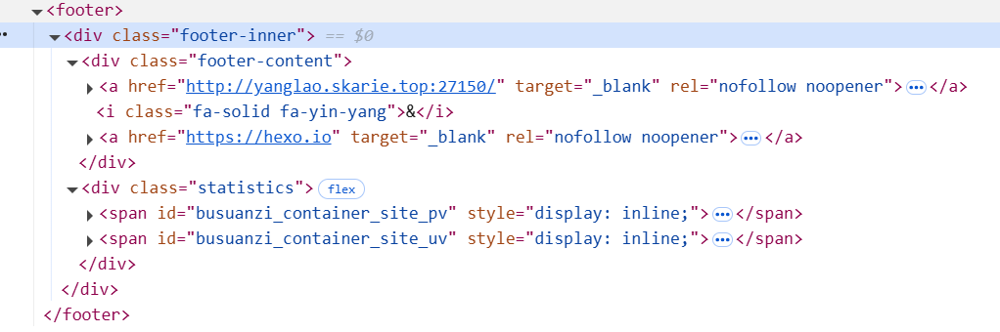
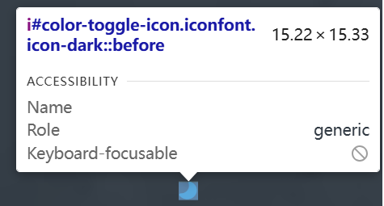
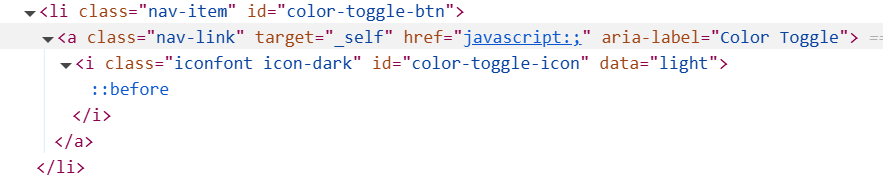

# 前言
主要是因为footer字体颜色和自己的自定义背景有冲突
然后需要修改，然后网上翻了一篇又一篇教程莫得看到随主题变换而变换的字体颜色
哎呀，确实木招儿了，只能自个儿动手写喽！
# 添加css样式

老规矩，采用注入的方式
定位到footer的位置

 ***PS：直接定义footer的样式的话，唔不好说出了问题，但是可以用`foot-inner`***
 在`source/css`目录新建`footer.css`
 footer.css:
 ```css
 :root {

    --day-footer-color: #00b318;//自定义字体颜色

    --night-footer-color: #d40000;//自定义字体颜色

}

  

.footer-inner {

    color: var(--day-footer-color);

  

    transition: color 0.3s ease, background-color 0.3s ease;

}

.night-mode .footer-inner {

    color: var(--night-footer-color);

  

}    

  

.footer-inner a {

    color: var(--day-footer-color);

    transition: color 0.3s ease;

}

.night-mode .footer-inner a {

    color: var(--night-footer-color);

  

    transition: color 0.3s ease;

}
```

最后`_config.fluid.yml`中的`custom_css`中引入
```yml
custom_css:
  - /css/footer.css
```

# 定义js监听事件实现字体颜色切换
在根目录新建`scripts`文件夹,新建`injector.js`
```js
const { root: siteRoot = "/" } = hexo.config;
hexo.extend.injector.register("body_end",`<script src="${siteRoot}js/footer.js"></script>`);
```
运用开发者工具查找出按钮的属性


在`source/js`目录新建`footer.js`
该js文件主要是用于监听主题切换的按钮是否被点击
footer.js:
```js
const colorToggleBtn = document.getElementById('color-toggle-btn');

const body = document.body;

  

colorToggleBtn.addEventListener('click', () => {

  body.classList.toggle('night-mode');

  const icon = document.getElementById('color-toggle-icon');

  if (body.classList.contains('night-mode')) {

    icon.classList.remove('icon-dark');

    icon.classList.add('icon-light'); // 如果有白天模式的图标类，添加它

  } else {

    icon.classList.remove('icon-light');

    icon.classList.add('icon-dark');

  }

});
```

好吧，测试出问题了，下面是目前最完美解决方案
[最新补充文章](/Fluid修改/对「Fluid主题footer颜色定义」补充定稿)