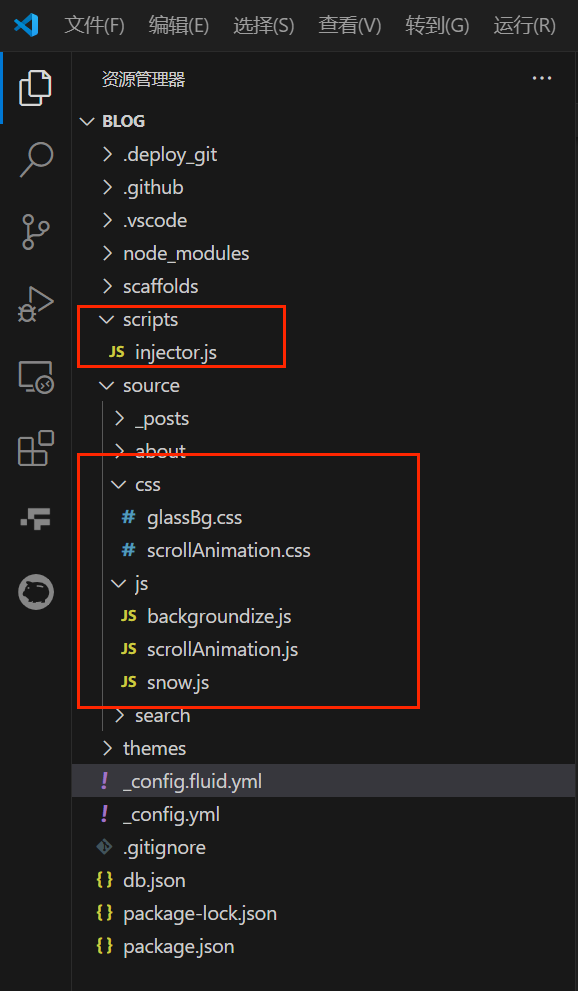
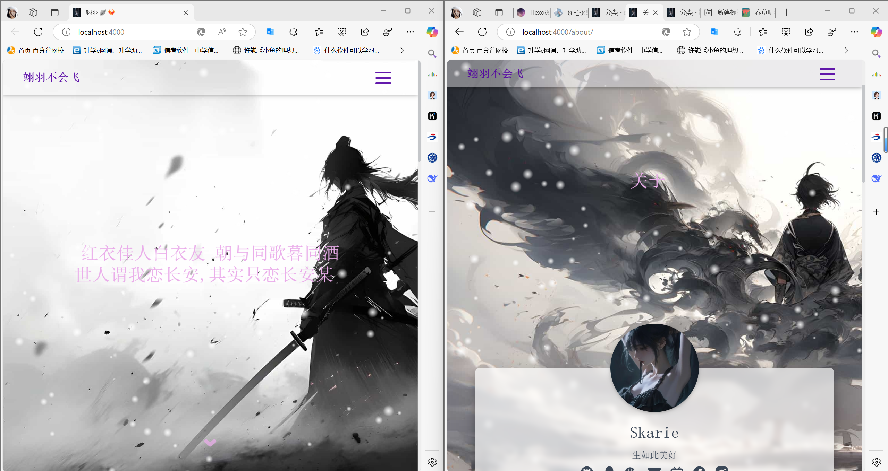
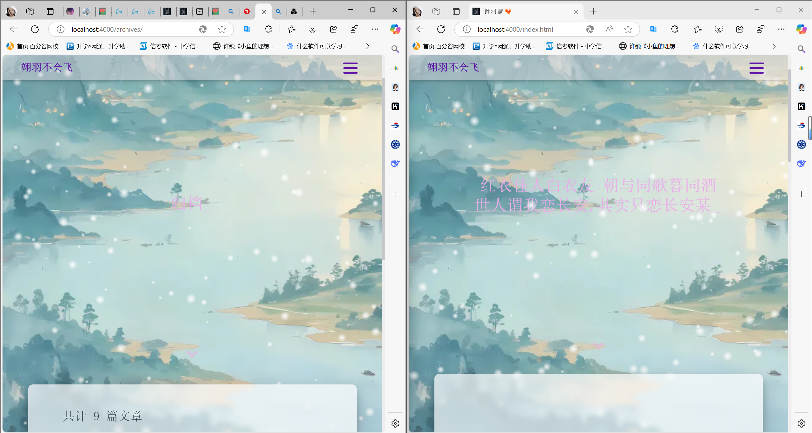
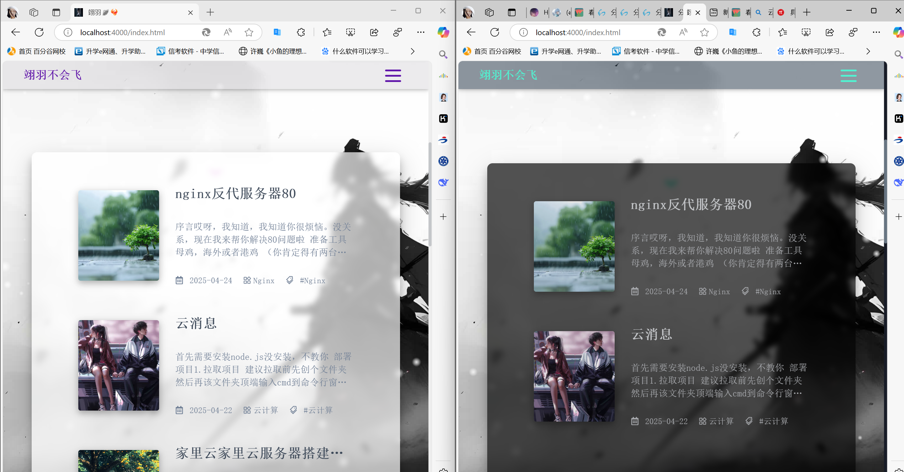

Fuild主题已经很好了，但是架不住有点小伙伴和我爱折腾
现在我们开始浅浅改一下
这次我们需要用到[Hexo的注入功能](https://hexo.io/zh-cn/api/injector.html)
这里我便不详细讲，因为似懂非懂的亚子
提供参考
[mRNA大佬的文章](https://mrna16.github.io/2024/11/14/%E3%80%90Hexo%E3%80%91Fluid%E4%B8%BB%E9%A2%98%E7%BE%8E%E5%8C%96/#%E8%B0%83%E6%95%B4%E5%B1%80%E9%83%A8%E6%96%87%E5%AD%97%E9%A2%9C%E8%89%B2)
[Hexo Fluid自定义 JS / CSS / HTML](https://hexo.fluid-dev.com/docs/guide/#%E8%87%AA%E5%AE%9A%E4%B9%89-js-css-html)
~~***PS:讲个笑话根据Fluid的开发文档，发现其实可以不要注入器直接加文件就好了***~~

# 注入容器

在根目录新建`scripts`文件夹,新建`injector.js`


```js

const { root: siteRoot = "/" } = hexo.config;

hexo.extend.injector.register("body_begin", `<div id="web_bg"></div>`);

hexo.extend.injector.register("body_end",`<script src="${siteRoot}js/backgroundize.js"></script>`);

  

hexo.extend.injector.register("body_end",`<script src="${siteRoot}js/snow.js"></script>`);

  

hexo.extend.injector.register("body_end",`<script src="${siteRoot}js/scrollAnimation.js"></script>`);
```

# 引入文件
>想要自定义美化效果，我们只需要引入Js文件和CSS文件。  
首先在注入器中加入我们希望注入的代码块，建议将Js脚本注入`body_end`部分，同时对照开发者工具中的HTML代码选择适当的注入位置。注入器中的Js文件都会被自动加入到网页资源中，因此不需要在`_config.fluid.yml`中的`custom_js`中重复引入。

***PS:这里的js和css文件都存放于博客根目录下的`source`文件夹中的`js`和`css`文件夹***

~~当然我不是寻常人，没有用注入的方法，而是直接再`_config.fluid.yml`中的`custom_js`中引入~~
记得在注入器里面引入js文件哦
js文件引入
```yml
custom_js:

  - /js/backgroundize.js

  - /js/scrollAnimation.js

  - /js/snow.js
```
css文件引入：
```yml
custom_css:

  - /css/glassBg.css

  - /css/scrollAnimation.css
```
# 全屏背景替换
有两个版本，一个是保持原本每个页面不一样图的风格
另一个是所有页面都是一个背景图
### 1.每个页面不一样图
在`source/js`目录新建`backgroundize.js`
```js
const bannerStyle = document.querySelector('.banner').getAttribute('style');

// 匹配背景图url部分

const match = bannerStyle.match(/url\(["'](.*?)["']\)/);

let bannerBackgroundImage = '';

if (match && match.length > 1) {

    bannerBackgroundImage = `url("${match[1]}")`;

}

  

// 设置#web_bg元素的背景图

document.querySelector('#web_bg')

   .setAttribute('style', `background: ${bannerBackgroundImage};position: fixed;width: 100%;height: 100%;z-index: -1;background-size: cover;`);

  

// 清除#banner元素的背景图

document.querySelector("#banner")

   .setAttribute('style', 'background: url()');

  

// 设置#banner .mask元素的背景颜色为透明

document.querySelector("#banner .mask")

   .setAttribute('style', 'background-color:rgba(0,0,0,0)');
```
效果图：

### 2.所有页面统一背景图
在`source/js`目录新建`backgroundize.js
```js
  

// 自定义背景图的 URL，你可以将其替换为你想要的背景图链接

const customBackgroundImage = 'https://haowallpaper.com/link/common/file/previewFileImg/16728359680265600';

  

// 设置 #web_bg 元素的背景图为自定义的背景图

document

  .querySelector('#web_bg')

  .setAttribute('style', `background-image: url(${customBackgroundImage});position: fixed;width: 100%;height: 100%;z-index: -1;background-size: cover;`);

  

// 清除 #banner 元素的背景图

document

  .querySelector("#banner")

  .setAttribute('style', 'background-image: url()');

  

// 设置 #banner .mask 元素的背景颜色为透明

document

  .querySelector("#banner .mask")

  .setAttribute('style', 'background-color:rgba(0,0,0,0)');
```


效果图：

# 落雪效果

在整个body上创建画布并创建雪花运动对象，模拟其运动即可。原文链接：[分享两种圣诞节雪花特效JS代码(网站下雪效果)](https://ihuan.me/2172.html)。
snow.js:
```
/* 控制下雪 */  
  
function snowFall(snow) {  
  
/* 可配置属性 */  
  
snow = snow || {};  
  
this.maxFlake = snow.maxFlake || 200; /* 最多片数 */  
  
this.flakeSize = snow.flakeSize || 10; /* 雪花形状 */  
  
this.fallSpeed = snow.fallSpeed || 1; /* 坠落速度 */  
  
}  
  
/* 兼容写法 */  
  
requestAnimationFrame = window.requestAnimationFrame ||  
  
window.mozRequestAnimationFrame ||  
  
window.webkitRequestAnimationFrame ||  
  
window.msRequestAnimationFrame ||  
  
window.oRequestAnimationFrame ||  
  
function(callback) { setTimeout(callback, 1000 / 60); };  
  
cancelAnimationFrame = window.cancelAnimationFrame ||  
  
window.mozCancelAnimationFrame ||  
  
window.webkitCancelAnimationFrame ||  
  
window.msCancelAnimationFrame ||  
  
window.oCancelAnimationFrame;  
  
/* 开始下雪 */  
  
snowFall.prototype.start = function(){  
  
/* 创建画布 */  
  
snowCanvas.apply(this);  
  
/* 创建雪花形状 */  
  
createFlakes.apply(this);  
  
/* 画雪 */  
  
drawSnow.apply(this)  
  
}  
  
/* 创建画布 */  
  
function snowCanvas() {  
  
/* 添加Dom结点 */  
  
var snowcanvas = document.createElement("canvas");  
  
snowcanvas.id = "snowfall";  
  
snowcanvas.width = window.innerWidth;  
  
snowcanvas.height = window.innerHeight;  
  
snowcanvas.setAttribute("style", "position: fixed; top: 0; left: 0; z-index: 1; pointer-events: none;");  
  
document.getElementsByTagName("body")[0].appendChild(snowcanvas);  
  
this.canvas = snowcanvas;  
  
this.ctx = snowcanvas.getContext("2d");  
  
/* 窗口大小改变的处理 */  
  
window.onresize = function() {  
  
snowcanvas.width = window.innerWidth;  
  
snowcanvas.height = window.innerHeight;  
  
}  
  
}  
  
/* 雪运动对象 */  
  
function flakeMove(canvasWidth, canvasHeight, flakeSize, fallSpeed) {  
  
this.x = Math.floor(Math.random() * canvasWidth); /* x坐标 */  
  
this.y = Math.floor(Math.random() * canvasHeight); /* y坐标 */  
  
this.size = Math.random() * flakeSize + 2; /* 形状 */  
  
this.maxSize = flakeSize; /* 最大形状 */  
  
this.speed = Math.random() * 0.2 + fallSpeed; /* 坠落速度 */  
  
this.fallSpeed = fallSpeed; /* 坠落速度 */  
  
this.velY = this.speed; /* Y方向速度 */  
  
this.velX = 0; /* X方向速度 */  
  
this.stepSize = Math.random() / 30; /* 步长 */  
  
this.step = Math.random()*Math.PI*2; /* 步数 */  
  
}  
  
flakeMove.prototype.update = function() {  
  
var x = this.x,  
  
y = this.y;  
  
/* 左右摆动(余弦) */  
  
this.velX *= 0.98;  
  
if (this.velY <= this.speed) {  
  
this.velY = this.speed  
  
}  
  
this.velX += Math.cos(this.step += .05) * this.stepSize;  
  
this.y += this.velY;  
  
this.x += this.velX;  
  
/* 飞出边界的处理 */  
  
if (this.x >= canvas.width || this.x <= 0 || this.y >= canvas.height || this.y <= 0) {  
  
this.reset(canvas.width, canvas.height)  
  
}  
  
};  
  
/* 飞出边界-放置最顶端继续坠落 */  
  
flakeMove.prototype.reset = function(width, height) {  
  
this.x = Math.floor(Math.random() * width);  
  
this.y = 0;  
  
this.size = Math.random() * this.maxSize + 2;  
  
this.speed = Math.random() * 1 + this.fallSpeed;  
  
this.velY = this.speed;  
  
this.velX = 0;  
  
};  
  
// 渲染雪花-随机形状（此处可修改雪花颜色！！！）  
  
flakeMove.prototype.render = function(ctx) {  
  
var snowFlake = ctx.createRadialGradient(this.x, this.y, 0, this.x, this.y, this.size);  
  
snowFlake.addColorStop(0, "rgba(255, 255, 255, 0.9)"); /* 此处是雪花颜色，默认是白色 */  
  
snowFlake.addColorStop(.5, "rgba(255, 255, 255, 0.5)"); /* 若要改为其他颜色，请自行查 */  
  
snowFlake.addColorStop(1, "rgba(255, 255, 255, 0)"); /* 找16进制的RGB 颜色代码。 */  
  
ctx.save();  
  
ctx.fillStyle = snowFlake;  
  
ctx.beginPath();  
  
ctx.arc(this.x, this.y, this.size, 0, Math.PI * 2);  
  
ctx.fill();  
  
ctx.restore();  
  
};  
  
/* 创建雪花-定义形状 */  
  
function createFlakes() {  
  
var maxFlake = this.maxFlake,  
  
flakes = this.flakes = [],  
  
canvas = this.canvas;  
  
for (var i = 0; i < maxFlake; i++) {  
  
flakes.push(new flakeMove(canvas.width, canvas.height, this.flakeSize, this.fallSpeed))  
  
}  
  
}  
  
/* 画雪 */  
  
function drawSnow() {  
  
var maxFlake = this.maxFlake,  
  
flakes = this.flakes;  
  
ctx = this.ctx, canvas = this.canvas, that = this;  
  
/* 清空雪花 */  
  
ctx.clearRect(0, 0, canvas.width, canvas.height);  
  
for (var e = 0; e < maxFlake; e++) {  
  
flakes[e].update();  
  
flakes[e].render(ctx);  
  
}  
  
/* 一帧一帧的画 */  
  
this.loop = requestAnimationFrame(function() {  
  
drawSnow.apply(that);  
  
});  
  
}  
  
/* 调用及控制方法 */  
  
var snow = new snowFall({maxFlake:60});  
  
snow.start();
```
# 文章划入动画
COPY于[mRNA的碎碎念Blog](https://mrna16.github.io/2024/11/14/%E3%80%90Hexo%E3%80%91Fluid%E4%B8%BB%E9%A2%98%E7%BE%8E%E5%8C%96/#%E8%B0%83%E6%95%B4%E5%B1%80%E9%83%A8%E6%96%87%E5%AD%97%E9%A2%9C%E8%89%B2)
scrollAnimation.js:
```
const cards = document.querySelectorAll('.index-card')  
  
if (cards.length) {  
  
document.querySelector('.row').setAttribute('style', 'overflow: hidden;')  
  
const coefficient = document.documentElement.clientWidth > 768 ? .5 : .3  
  
const origin = document.documentElement.clientHeight - cards[0].getBoundingClientRect().height * coefficient  
  
function throttle(fn, wait) {  
  
let timer = null;  
  
return function () {  
  
const context = this;  
  
const args = arguments;  
  
if (!timer) {  
  
timer = setTimeout(function () {  
  
fn.apply(context, args);  
  
timer = null;  
  
}, wait)  
  
}  
  
}  
  
}  
  
function handle() {  
  
cards.forEach(card => {  
  
card.setAttribute('style', `--state: ${(card.getBoundingClientRect().top - origin) < 0 ? 1 : 0};`)  
  
})  
  
console.log(1)  
  
}  
  
document.addEventListener("scroll", throttle(handle, 100));  
  
}
```
scrollAnimation.css:
```
.index-card {  
transition: all 0.5s;  
transform: scale(calc(1.5 - 0.5 * var(--state)));  
opacity: var(--state);  
margin-bottom: 2rem;  
}  
  
.index-img img {  
margin: 20px 0;  
}
```
# 毛玻璃主面板

在配置文件`_config.fluid.yml`中调整board_color：
```yml
board_color: "#ffffffad"

board_color_dark: "#000000ad"
```
然后添加glassBg.css文件
```css
#board {

  -webkit-backdrop-filter: blur(5px);

  backdrop-filter: blur(5px);

  border-radius: 10px;

}

  #toc {

    padding: 10px;

    top: 4rem;

    background-color: var(--board-bg-color);

    border-radius: 10px;

    -webkit-backdrop-filter: blur(15px);

    backdrop-filter: blur(15px);

  }
```
这样便可以为主面板board部分和侧边栏toc部分都添加了模糊样式，实现了毛玻璃效果。
效果图：

***PS:本地配置的话记得`hexo g`退出，然后`hexo clean`清除缓存，然后再`hexo s`启动***
