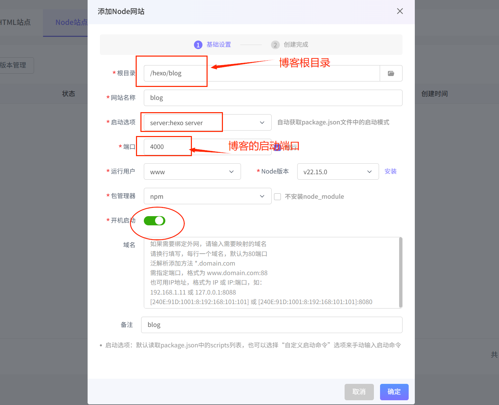
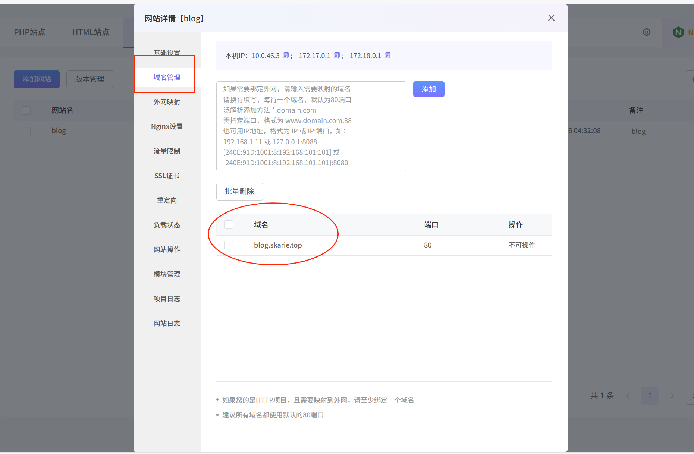
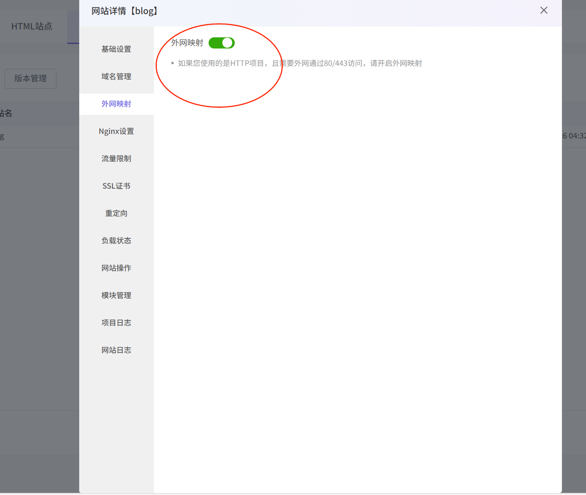
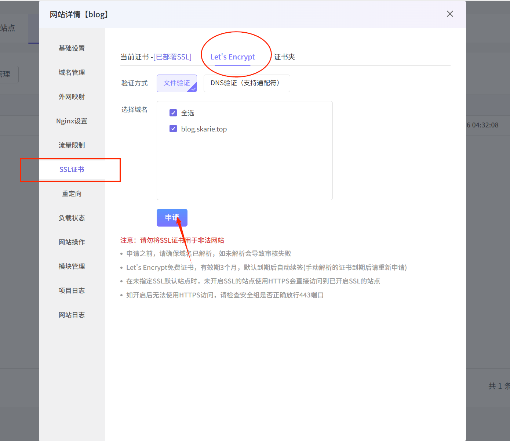

# 序言
之前是一直用的1panel的docker部署hexo发现内存占用太高了
然后就换宝塔，(npm部署)哦豁，也是一样的高，
然后就换XP，还好不高，以为可以了，然后发现xp上传文件总是缺胳膊少量（吐血）
不过勉强将就用一下

# 环境部署
这里以xp 为例子，部署hexo
前提最新版node.js
```ssh
curl -fsSL https://deb.nodesource.com/setup_current.x | sudo -E bash -
```
```ssh
sudo apt install -y nodejs
```
装好了你可以`node -v`和`npm -v`查看版本
# 安装hexo
我们开始下一步这里可以参考[文档 | Hexo](https://hexo.io/zh-cn/docs/)
不过我喜欢在根目录创建文件部署
首先使用`cd /`回到系统根目录
然后创建文件夹hexo
```
mkdir hexo
```
然后执行命令安装hexo
```
npm install -g hexo-cli
```
当然你也可以不全局安装
```ssh
npm install hexo
```
# Hexo建站
安装 Hexo 完成后，请执行下列命令，Hexo 将会在指定文件夹中新建所需要的文件
```
hexo init <folder>  
cd <folder>  
npm install
```
***PS:`<folder>`为文件夹名称***
初始化后，您的项目文件夹将如下所示：
```plantext
.  
├── _config.yml  
├── package.json  
├── scaffolds  
├── source  
|   ├── _drafts  
|   └── _posts  
└── themes
```
到这里你就已经得到了一个hexo博客了

但是你要运行它可以在当前目录终端输入
```ssh
hexo s
```
就会得到访问地址http://localhost:4000（http://ip:4000）

但是这个时候你关闭终端，这个前台任务就会被杀死，然后就无法访问
不要慌，打开你的xp
新建一个node站点
图下配置



然后返回浏览器重新输入地址
嗯，可以正常访问
# 使用域名加https访问
不过你的访问是域名带端口我来教你解决
回到我们的node站点，添加域名

打开外网映射


接着打开SSL证书，然后点击Let'sEncrypt选择要申请的域名，点击申请




***PS:关于跟新文章要在终端关闭4000端口进程***
***在 Linux 系统中，你可以借助以下命令查找占用端口 4000 的进程***
```bash
sudo lsof -i :4000
```
***此命令会列出所有占用端口 4000 的进程及其相关信息。找到进程 ID（PID）后，使用下面的命令终止该进程***
```bash
sudo kill -9 <PID>
```
***然后再`hexo clean`和`hexo g`,`hexo s`***
