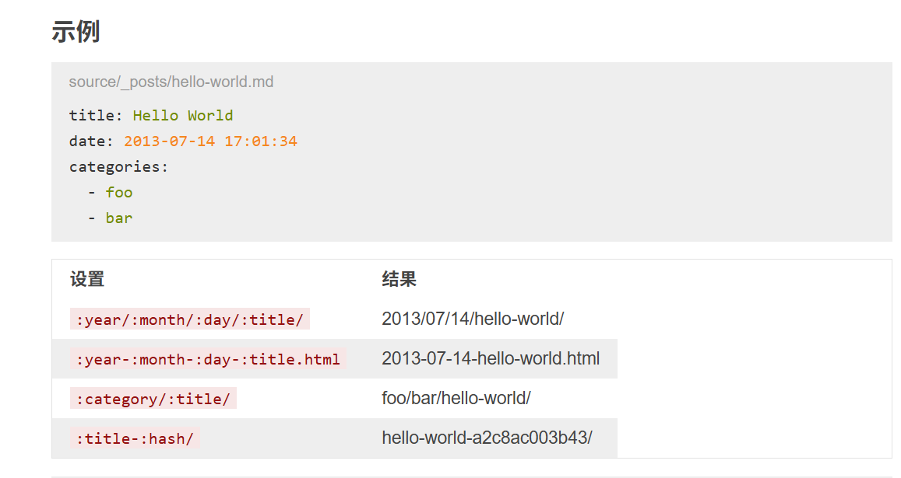
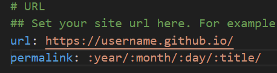

文章内跳转还行，小问题
但是文章与文章直接跳转麻烦了
之前一直用相对路径表示但是一直没有跳转
查阅了开发文档后，发现咦，我的方法，没有错哎，
可是不能理解每次跳转都是
>Cannot GET /2025/04/20/Hexo%E4%BF%AE%E6%94%B9/Fluid%E4%B8%BB%E9%A2%98footer%E9%A2%9C%E8%89%B2%E5%AE%9A%E4%B9%89/%E5%AF%B9%E3%80%8CFluid%E4%B8%BB%E9%A2%98footer%E9%A2%9C%E8%89%B2%E5%AE%9A%E4%B9%89%E3%80%8D%E8%A1%A5%E5%85%85%E5%AE%9A%E7%A8%BF

就很烦，然后发现哦哦哦，原来文章链接是可以自定义格式的，
突然有个大胆的猜测，赶紧去翻开发文档，如何自定义文章链接

一看，哦豁，这不就对头了嘛，
然后一看`_config.yml`配置文件，

还真的是，然后做了如下修改
```_config.yml
# URL

## Set your site url here. For example, if you use GitHub Page, set url as 'https://username.github.io/project'

url: https://username.github.io/

#permalink: :year/:month/:day/:title/

permalink: :title/

permalink_defaults:

pretty_urls:

  trailing_index: true # Set to false to remove trailing 'index.html' from permalinks

  trailing_html: true # Set to false to remove trailing '.html' from permalinks
```
然后就能正常跳转了了
不过这里注意
文章链接格式是
```
[Hexo图片显示](/Hexo/Hexo图片显示)
```
中括号是你要显示的内容`[]`
`()`里是绝对文章路径他是基于`_post`文件夹下的路径
其中`Hexo`是`_post`文件夹下的一个子文件夹，
`Hexo图片`显示则是其文件名
***PS：记得前面要带`/`***
示例：
[Hexo图片显示](/Hexo/Hexo图片显示)
