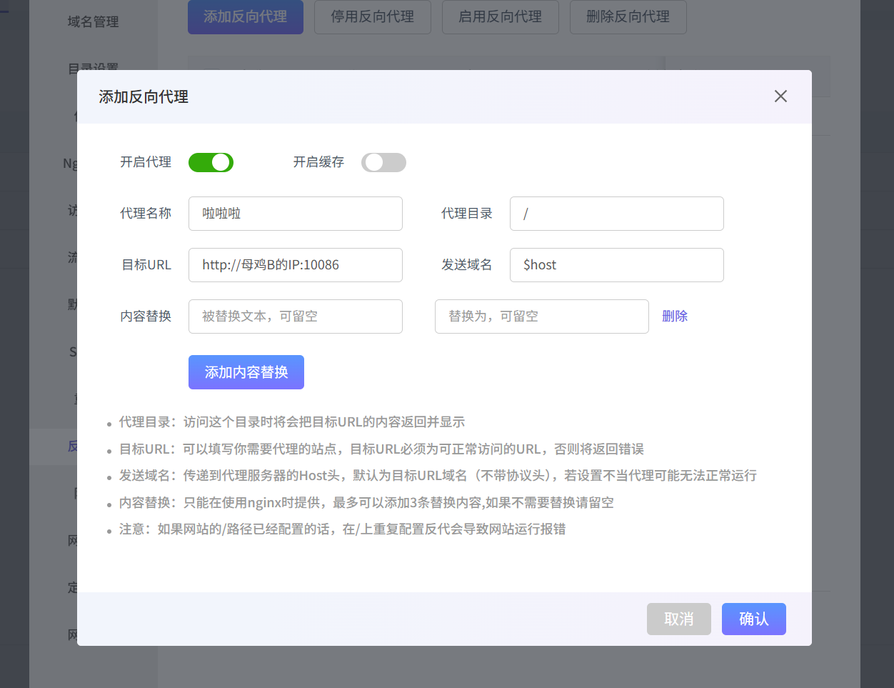

## 序言
哎呀，我知道，我知道你很烦恼。
没关系，现在我来帮你解决80问题啦
## 准备工具
- 母鸡，海外或者港鸡 ***（你肯定得有两台吧）***
- 域名
- Nginx
## 开始
说明：为了便于区分将海外母鸡命名为`母鸡A`，被反代的母鸡则为`母鸡B`
### 1.
首先得确保你的海外母鸡安装了nginx,
我这里以xp面板作为演示（你也可以安装宝塔和1panel）：
### 2. 
在`母鸡A`上添加网站，填写[域名](https://cloud.tencent.com/product/domain?from_column=20065&from=20065)就可以啦，记得域名要解析到`母鸡A`。这里以`test.skarie.top`为例 接着去`母鸡B`，绑定域名`test.skarie.top:8080`端口只要不是`80`就行了
### 3.
继续转到`母鸡A`，在`xp面板`的网站设置中找到反向代理，点进去添加代理，如图填写即可

这里如果用宝塔面板可能还要多一步
点配置文件，使用如下配置（主要是修改IP）

```nginx
#PROXY-START/

location ~* .(php|jsp|cgi|asp|aspx)$

{

proxy_pass http://母鸡B的IP:8080;

proxy_set_header Host $host;

proxy_set_header X-Real-IP $remote_addr;

proxy_set_header X-Forwarded-For $proxy_add_x_forwarded_for;

proxy_set_header REMOTE-HOST $remote_addr;

}

location /

{

proxy_pass http://母鸡B的IP:8080;

proxy_set_header Host $host;

proxy_set_header X-Real-IP $remote_addr;

proxy_set_header X-Forwarded-For $proxy_add_x_forwarded_for;

proxy_set_header REMOTE-HOST $remote_addr;

  

add_header X-Cache $upstream_cache_status;

  

#Set Nginx Cache

  

add_header Cache-Control no-cache;

}

  

#PROXY-END/
```
## 完结与注意
改完后你输入在浏览器输入`test.skarie.top`
***O i***
终于摆脱了尾巴带端口的折磨
but
坏消息
成功访问不到一分钟，就被拦截了

嘿嘿，大佬们说改成高位端口就好了

~~27250~~

