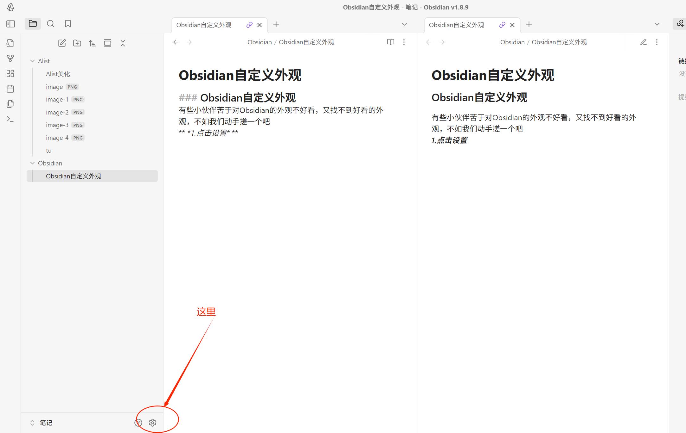
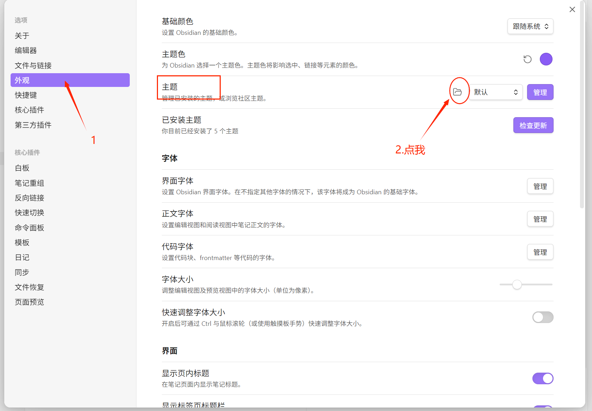
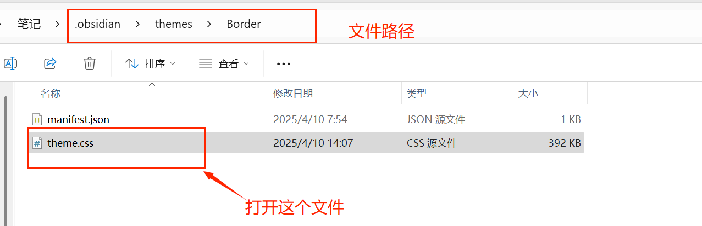
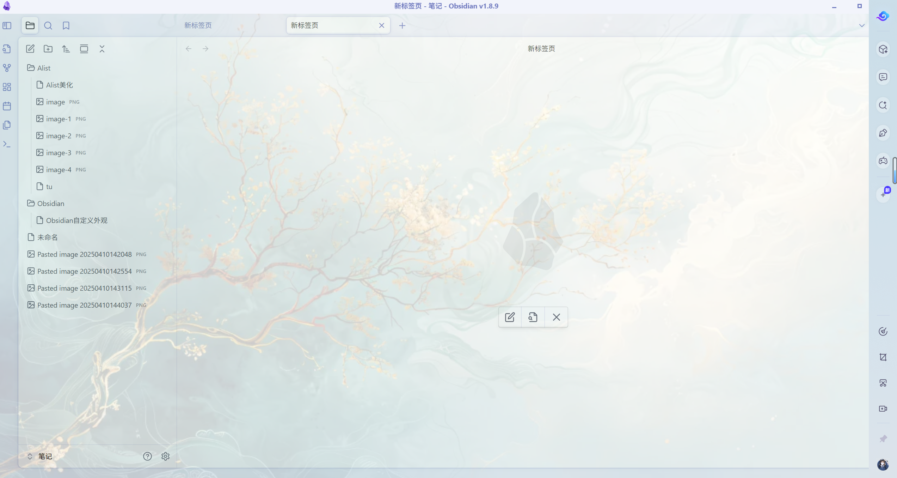
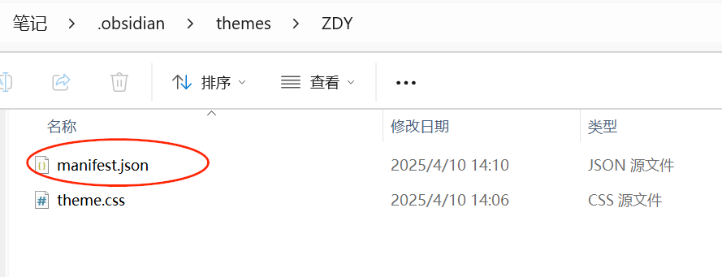
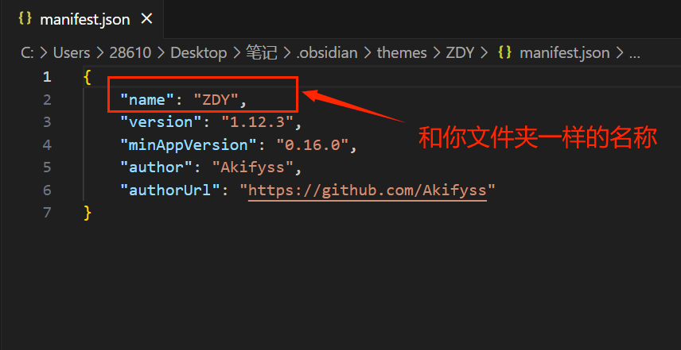
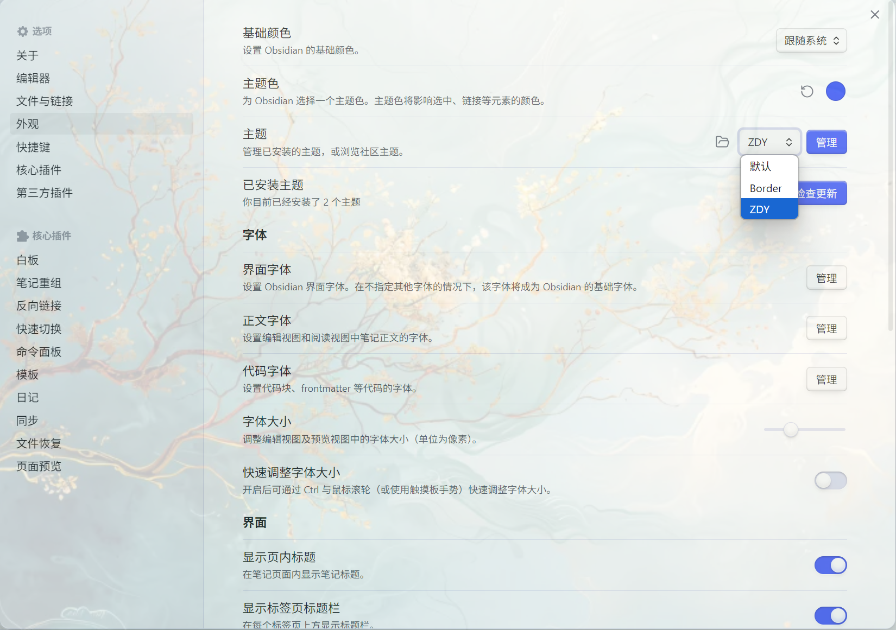

### Obsidian自定义外观
有些小伙伴苦于对Obsidian的外观不好看，又找不到好看的外观，不如我们动手搓一个吧
***1.点击设置***

*2.打开后选着外观，主题，点击旁边的文件夹图标，打开主题文件所在的文件夹*

*3.进去后我们打开css文件开始编辑*

*4.再文件顶部加上以下代码*
```css
/* @settings

  

name: Background Image Settings | 背景图片设置

id: background-image-settings

settings:

    -

        id: light-background-image

        title: Light Theme Background Image URL

        title.zh: 浅色主题背景图片 URL

        type: variable-text

        default: url(https://haowallpaper.com/link/common/file/previewFileImg/16615442655006080)

  
  
  

    -

        id: dark-background-image

        title: Dark Theme Background Image URL

        title.zh: 深色主题背景图片 URL

        type: variable-text

        default: url(https://haowallpaper.com/link/common/file/previewFileImg/79dc761210915a5728604c762b6fc0bd)

    -

        id: background-opacity

        title: Background Image Opacity

        title.zh: 背景图片不透明度

        type: variable-number-slider

        default: 0.2

        min: 0

        max: 1

        step: 0.01

        format:

  

    -

        id: background-image-blur

        title: Blur Amount

        title.zh: 模糊程度

        type: variable-number-slider

        default: 0

        min: 0

        max: 20

        step: 0.1

        format: px

  

    -

        id: background-image-contrast

        title: Contrast

        title.zh: 对比度

        type: variable-number-slider

        default: 1

        min: 0

        max: 3

        step: 0.1

        format:

  

    -

        id: background-image-saturate

        title: Saturate

        title.zh: 饱和度

        type: variable-number-slider

        default: 1

        min: 0

        max: 3

        step: 0.1

        format:

  

    -

        id: background-image-brightness

        title: Brightness

        title.zh: 亮度

        type: variable-number-slider

        default: 1

        min: 0

        max: 3

        step: 0.1

        format:

  

*/

body {

    --light-background-image: url(https://haowallpaper.com/link/common/file/previewFileImg/16683500614176128);

    --dark-background-image: url(https://haowallpaper.com/link/common/file/previewFileImg/15736885660324160);

     --background-opacity: 0.3;

    --background-image-blur: 0;

    --background-image-contrast: 1;

    --background-image-saturate: 1;

    --background-image-brightness: 1;

  }

  /* CSS Styling to apply these settings */

  .theme-light {

    --background-image: var(--light-background-image);

    --opacity-translucency: 0.1;

  }

  .theme-dark {

    --background-image: var(--dark-background-image);

  }

  body::before {

    content: "";

    position: fixed;

    background-image: var(--background-image);

    background-position: center center;

    background-attachment: fixed;

    background-size: cover;

    background-repeat: no-repeat;

    height: 100%;

    width: 100%;

    filter: blur(var(--background-image-blur)) contrast(var(--background-image-contrast)) saturate(var(--background-image-saturate)) brightness(var(--background-image-brightness));

    opacity: var(--background-opacity);

    z-index: var(--layer-menu);

    pointer-events: none;

    transition: none;

  }
```
*5.保存退出，重启Obsidian*
*回来你就会发现，哇哦，也太好看了吧（⊙ｏ⊙）*

#### 当然有的小伙伴会发现改完了变不回去了

没事我们回到选择外观打开文件的那一步

***这次我们打开ZDY文件夹，后续步骤和3.和4步骤***
### ！！！划重点！！！
*6.接下来我们打开这个文件*

*7.编辑```name：```字段保持其名称和文件夹一样*

*8然后我们回到外观界面，发现识别到了ZDY的主题*


***
***OKay,完结***
