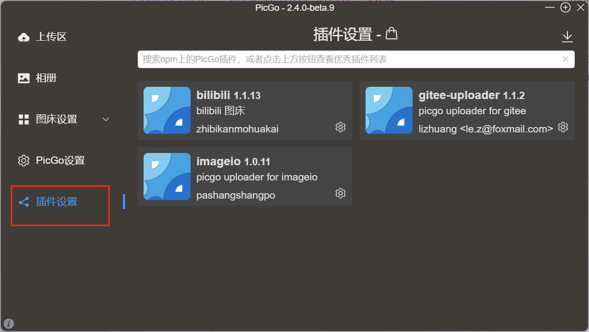
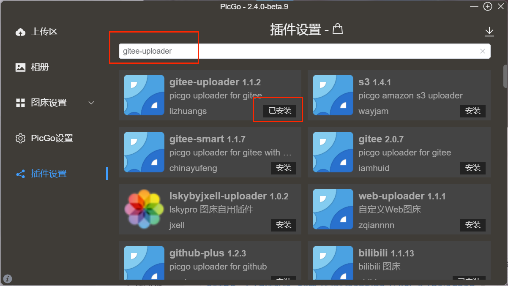
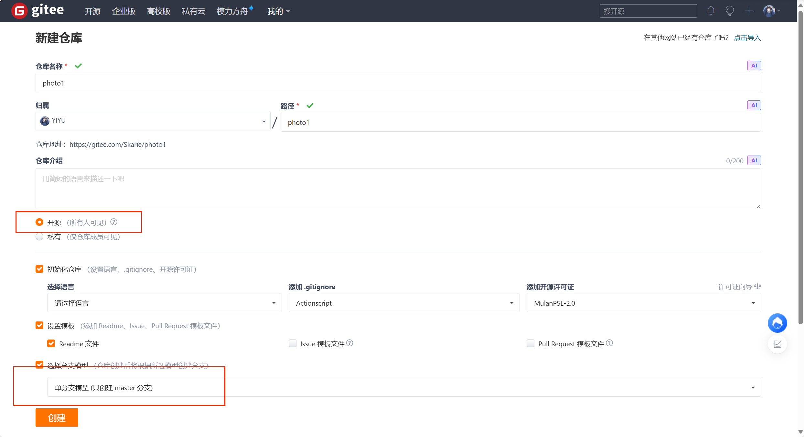
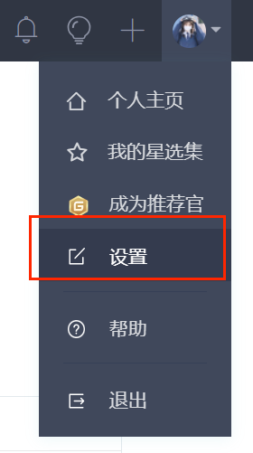
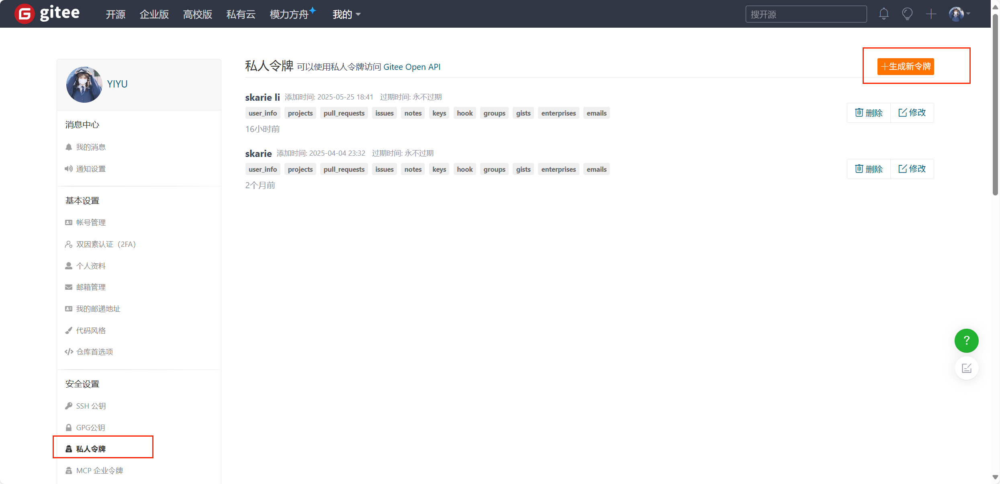
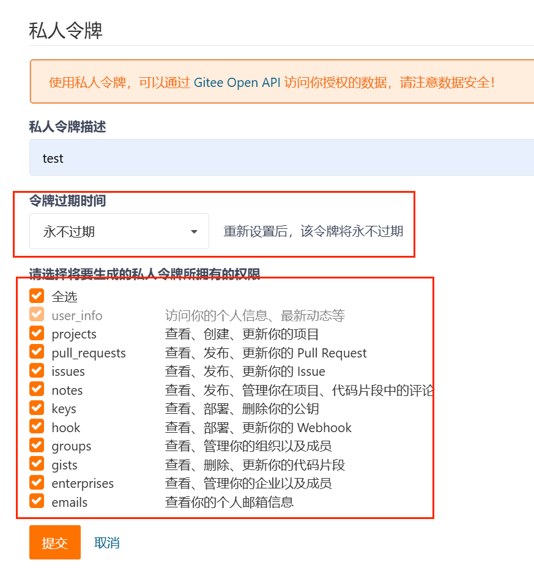
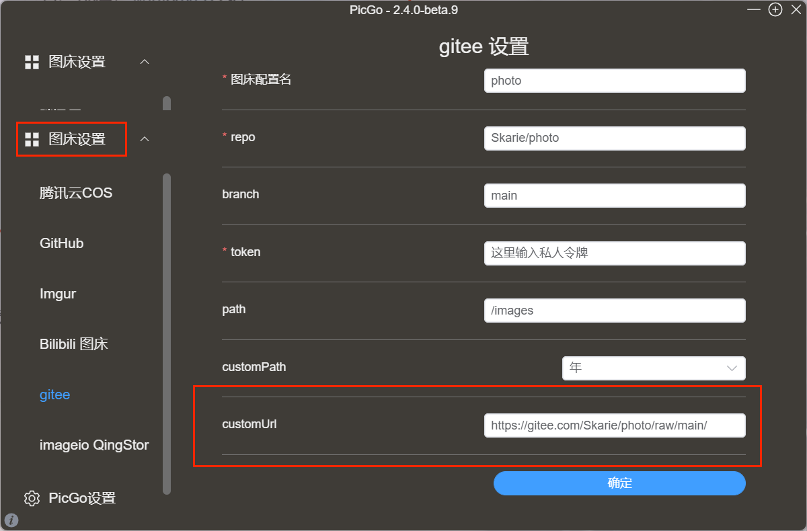
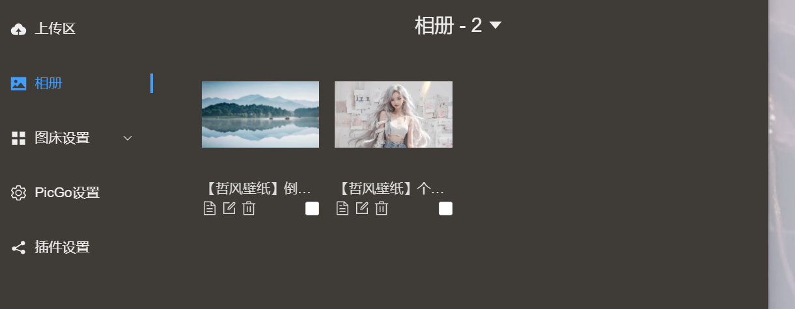
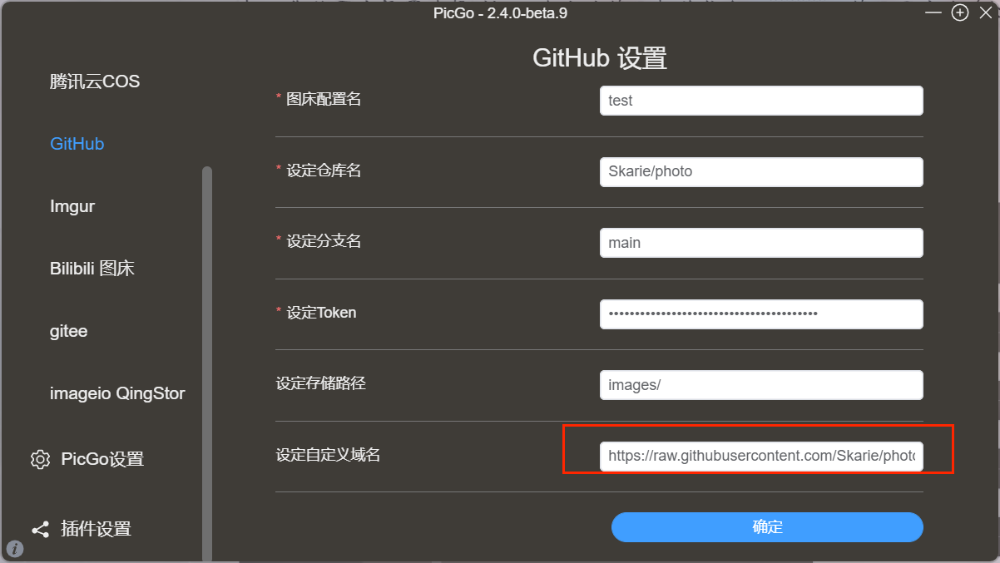

# Picgo+gitee

## picgo安装
### 下载安装
| 下载源                                             | 地址/安装方式                                                                                    | 平台         | 备注                    |     |
| ----------------------------------------------- | ------------------------------------------------------------------------------------------ | ---------- | --------------------- | --- |
| GitHub Release                                  | https://github.com/Molunerfinn/PicGo/releases                                              | All        | 国内下载速度可能会慢            |     |
| [腾讯云COS](https://cloud.tencent.com/product/cos) | https://github.com/Molunerfinn/PicGo/releases 附在更新日志结尾                                     | All        | 感谢 腾讯云COS 🚀 提供的赞助支持  |     |
| [山东大学镜像站](https://mirrors.sdu.edu.cn/)          | https://mirrors.sdu.edu.cn/github-release/Molunerfinn_PicGo                                | All        | 感谢 山东大学镜像站 🚀 提供的镜像支持 |     |
| [Scoop](https://scoop.sh/)                      | `scoop bucket add helbing https://github.com/helbing/scoop-bucket` & `scoop install picgo` | Windows    | 感谢 @helbing 的贡献       |     |
| [Chocolatey](https://chocolatey.org/)           | `choco install picgo`                                                                      | Windows    | 感谢 @iYato 的贡献         |     |
| [Homebrew](https://brew.sh/)                    | `brew install picgo --cask`                                                                | macOS      | 感谢 @womeimingzi11 的贡献 |     |
| [AUR](https://aur.archlinux.org/packages/yay)   | `yay -S picgo-appimage`                                                                    | Arch-Linux | 感谢 @houbaron 的贡献      |     |
## 在picgo安装gitee-uploader

- 打开pcigo，点击插件设置
- 
- 在搜索框搜索`gitee-uploader`
- 
- 点击安装
## 登陆gitee创建仓库并配置私人令牌

1. 首先创建一个photo的存储仓库
2. 然后记得仓库状态选择公开

3. 点击头像选择设置
   
4. 点击私人令牌，选择生成新私人令牌

注意令牌过期时间选择永不过期
权限全选

生成的令牌记得复制保存好

## 配置picgo
打开你的图床设置选择gitee,在右边填写相关信息，`repo`：填写用户名/仓库名称
`branch`:选择分支,`path`:选择路径，
`customUrl`：填写图片的链接路径（很重要，关乎到你相册能不能看到图片）
链接路径解释：
https://gitee.com/Skarie(用户名)/photo(仓库名)/raw/main(分支)/

然后你上传一张图片就能在相册里看到

# Picgo+github

### 下载安装
| 下载源                                             | 地址/安装方式                                                                                    | 平台         | 备注                    |     |
| ----------------------------------------------- | ------------------------------------------------------------------------------------------ | ---------- | --------------------- | --- |
| GitHub Release                                  | https://github.com/Molunerfinn/PicGo/releases                                              | All        | 国内下载速度可能会慢            |     |
| [腾讯云COS](https://cloud.tencent.com/product/cos) | https://github.com/Molunerfinn/PicGo/releases 附在更新日志结尾                                     | All        | 感谢 腾讯云COS 🚀 提供的赞助支持  |     |
| [山东大学镜像站](https://mirrors.sdu.edu.cn/)          | https://mirrors.sdu.edu.cn/github-release/Molunerfinn_PicGo                                | All        | 感谢 山东大学镜像站 🚀 提供的镜像支持 |     |
| [Scoop](https://scoop.sh/)                      | `scoop bucket add helbing https://github.com/helbing/scoop-bucket` & `scoop install picgo` | Windows    | 感谢 @helbing 的贡献       |     |
| [Chocolatey](https://chocolatey.org/)           | `choco install picgo`                                                                      | Windows    | 感谢 @iYato 的贡献         |     |
| [Homebrew](https://brew.sh/)                    | `brew install picgo --cask`                                                                | macOS      | 感谢 @womeimingzi11 的贡献 |     |
| [AUR](https://aur.archlinux.org/packages/yay)   | `yay -S picgo-appimage`                                                                    | Arch-Linux | 感谢 @houbaron 的贡献      |     |

## 登陆github创建仓库并配置密钥

1. 首先创建一个photo的存储创库
2. 然后记得仓库状态选择公开
   ![[./picgo+gitee+github搭建图床/10.png]]
3. 点击头像，选择`Settings`,然后选择`Developer settings`
   然后如图所示操作：
   ![[./picgo+gitee+github搭建图床/11.png]]
4. 然后配置密钥参数，选择永不过期，勾选`repo`全部权限
   ![[./picgo+gitee+github搭建图床/12.png]]
5. 配置完成点击`Generate token`记住你的密钥
## 配置picgo
打开你的图床设置选择github,在右边填写相关信息，`设定仓库名`：填写用户名/仓库名称
`设定分支名`:选择分支,`设定存储路径`:选择路径，`设定Token`:填写你之前复制的密钥
`设定自定义域名`：填写图片的链接路径（很重要，关乎到你相册能不能看到图片）
链接路径解释：
~~/https://github.com/Skarie(用户名)/photo(仓库名)/raw/main(分支)/ ~~
https://raw.githubusercontent.com/Skarie/photo/main

然后你上传一张图片就能在相册里看到

eg:
[【哲风壁纸】倒影-宁静水面](https://raw.githubusercontent.com/Skarie/photo/main/images/%E3%80%90%E5%93%B2%E9%A3%8E%E5%A3%81%E7%BA%B8%E3%80%91%E5%80%92%E5%BD%B1-%E5%AE%81%E9%9D%99%E6%B0%B4%E9%9D%A2-%E5%B1%B1%E6%B0%B4.png)