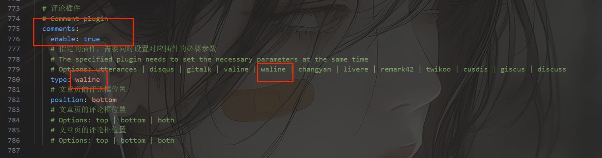
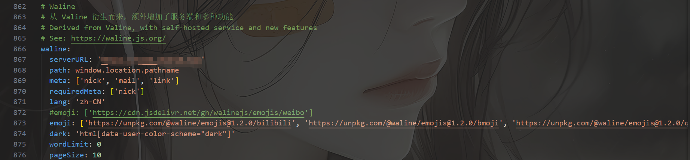
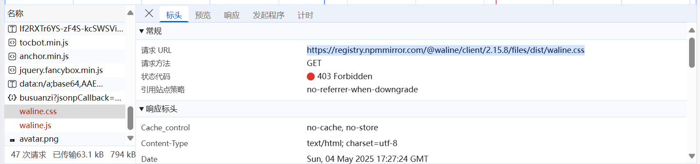
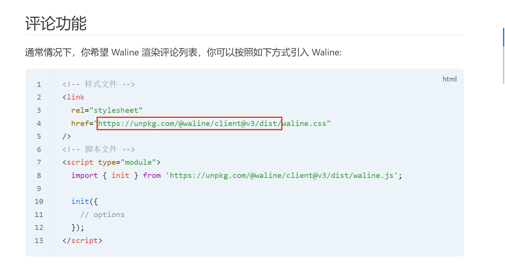
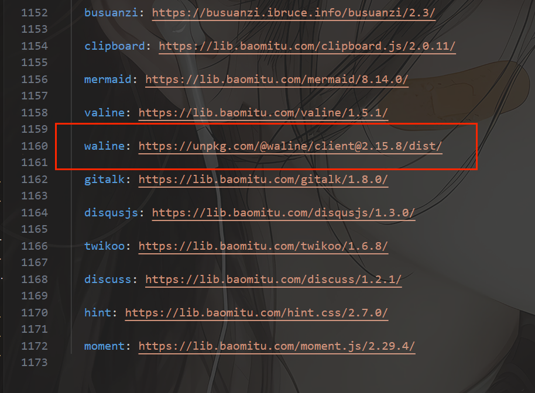
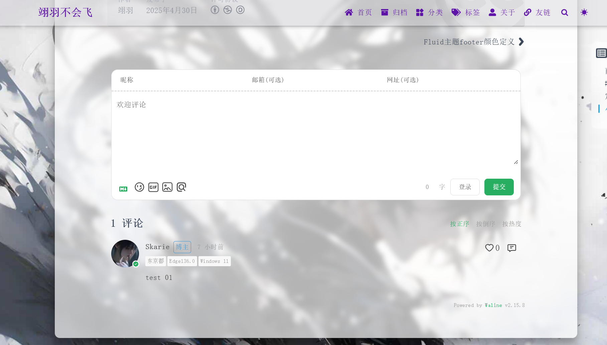

记录一下，现在是凌晨三点

# 安装waline
## 1. 安装
[快速上手 | Waline](https://waline.js.org/guide/get-started/)
首先我们需要在LeanCloud 上创建应用
这里分国内和国外（推荐）
[LeanCloud（国内）](https://www.leancloud.cn/)
[LeanCloud（国外）](https://leancloud.app/)
然后你得记住三个key
然后的然后你可以参考教程[快速上手 | Waline](https://waline.js.org/guide/get-started/)

## 2. 部署客户端
这里要了我狗命
首先在主题配置文件中我们要开启评论`enable: true`，然后我们的评论用的是waline所以这里填写`type: waline`

还没完
往下走，配置waline的相关参数

```yml
# Waline
# 从 Valine 衍生而来，额外增加了服务端和多种功能
# Derived from Valine, with self-hosted service and new features
# See: https://waline.js.org/
waline:
  serverURL: 'https://01.test.top'
  path: window.location.pathname
  meta: ['nick', 'mail', 'link']
  requiredMeta: ['nick']
  lang: 'zh-CN'
  #emoji: ['https://cdn.jsdelivr.net/gh/walinejs/emojis/weibo']
  emoji: ['https://unpkg.com/@waline/emojis@1.2.0/bilibili', 'https://unpkg.com/@waline/emojis@1.2.0/bmoji', 'https://unpkg.com/@waline/emojis@1.2.0/qq', 'https://unpkg.com/@waline/emojis@1.2.0/weibo', 'https://unpkg.com/@waline/emojis@1.2.0/tieba']
  dark: 'html[data-user-color-scheme="dark"]'
  wordLimit: 0
  pageSize: 10
```
然后到这里都配置完了
正常情况下是可以访问，看到评论模块的
但是吧，由于，可能是反代的原因吧
这个css和js文件一直请求不成功

然后瞎搞ing,以为是反代问题，跨域请求问题，甚至我还搞了一波Hexo注入,
当然失败了
然后就疯狂的翻阅文档，直到看见[通过 CDN 导入 Waline | Waline](https://waline.js.org/cookbook/import/cdn.html)
通过cdn,导入，到这里还是不太明白。
然后就继续问AI，网上冲浪，然后就看到友友说的在配置文件最下面改cdn,
这个时候才恍然大悟
然后就返回官网偷了这么一串

然后不嘻嘻，还是不行然后突然看到后面的说明，好像他还没有发布3.xx的版本，
然后就找了一个版本改了一下

然后就成了
