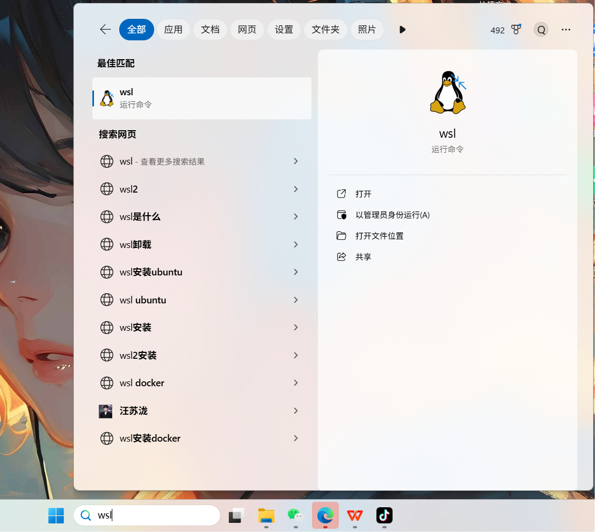
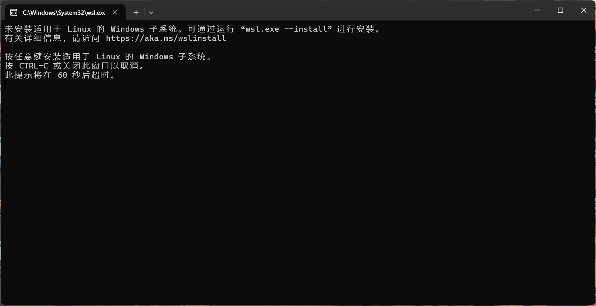
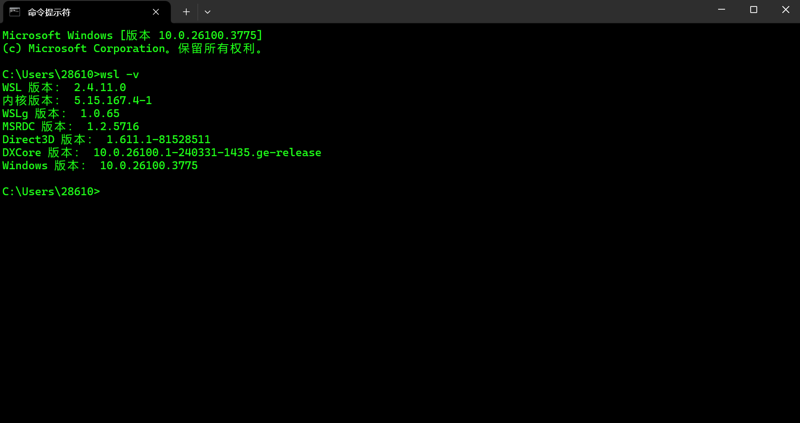
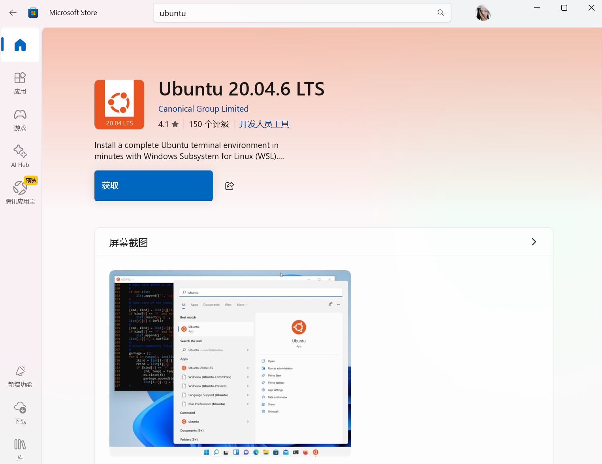
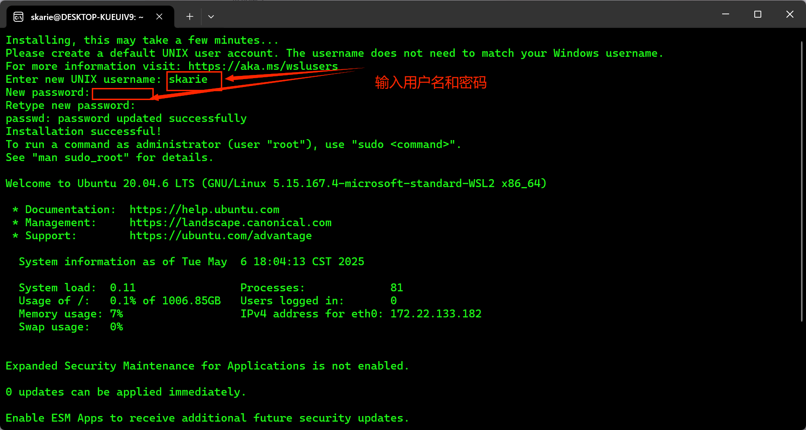
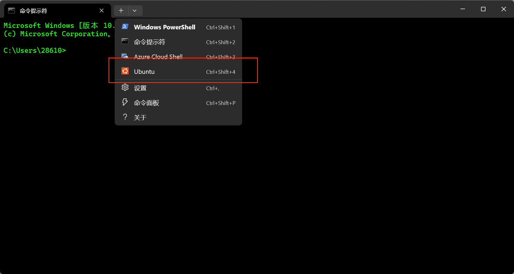
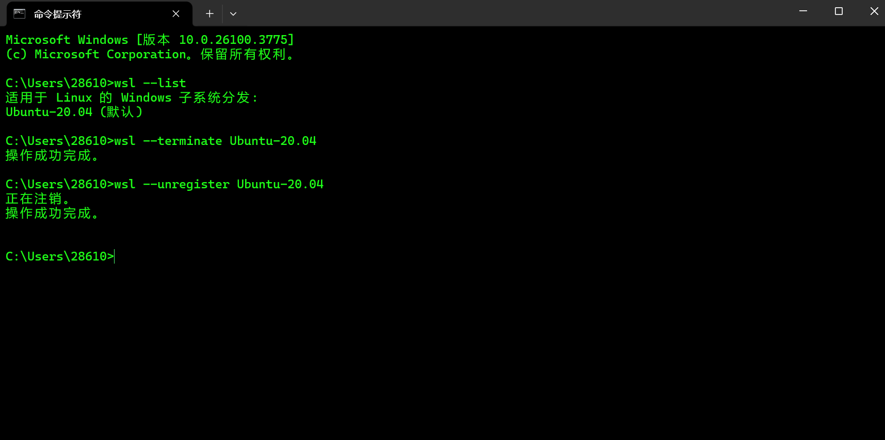
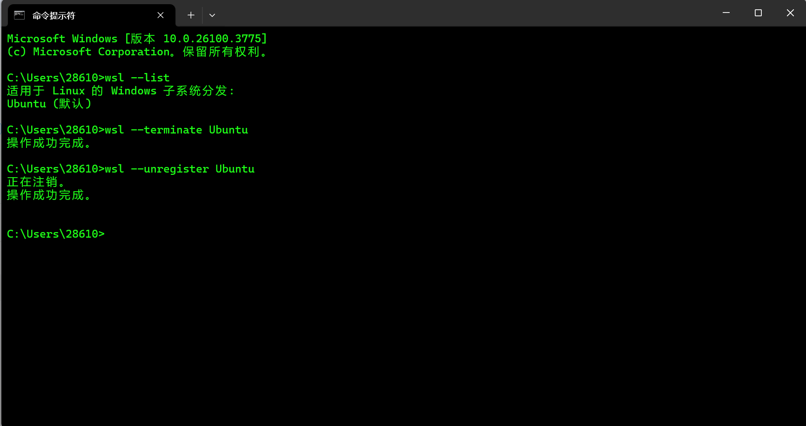

# 1.安装wsl
下方搜索栏输入`wsl`,点击打开



然后任意键触发安装


安装完成后他会自己关闭窗口

你可以打开cmd
输入:
```bash
wsl -v
```
来验证是否安装成功


# 2. 安装Linux系统

这里有两种方法，
## 方法1
打开微软商店
输入ubuntu，点击获取



完了之后点击打开
会跳转到命令窗口
根据提示输入你的用户名和密码


到这里你就安装成功了
然后，可以再cmd窗口下拉菜单栏中选择



也可以可以直接cdm输入wsl（登陆后记得输入`cd /`）
### 卸载
#### 步骤 1：确认分发版名称

你已通过`wsl --list`命令得知分发版名称为`Ubuntu-20.04 `，如果不清楚，可以再次运行该命令来确认。

#### 步骤 2：终止正在运行的分发版实例

在卸载之前，要确保分发版实例已经停止运行。可以在 PowerShell 或命令提示符中执行以下命令来终止：

```powershell
wsl --terminate Ubuntu-20.04
```

#### 步骤 3：卸载分发版

使用以下命令来卸载指定的 WSL 分发版：

```powershell
wsl --unregister Ubuntu-20.04
```

执行此命令后，WSL 会移除该分发版，并且删除其相关文件。不过，要注意这一操作是不可逆的，在执行前请备份好重要数据。



## 方法2
cmd
输入`wsl`
可以直接安装ubuntu系统


然后，下次进入可以直接cdm输入`wsl`
也可以再cmd窗口下拉菜单栏中选择


### 卸载
#### 步骤 1：确认分发版名称

你已通过`wsl --list`命令得知分发版名称为`Ubuntu`，如果不清楚，可以再次运行该命令来确认。

#### 步骤 2：终止正在运行的分发版实例

在卸载之前，要确保分发版实例已经停止运行。可以在 PowerShell 或命令提示符中执行以下命令来终止：

```powershell
wsl --terminate Ubuntu
```

#### 步骤 3：卸载分发版

使用以下命令来卸载指定的 WSL 分发版：

```powershell
wsl --unregister Ubuntu
```

执行此命令后，WSL 会移除该分发版，并且删除其相关文件。不过，要注意这一操作是不可逆的，在执行前请备份好重要数据。

