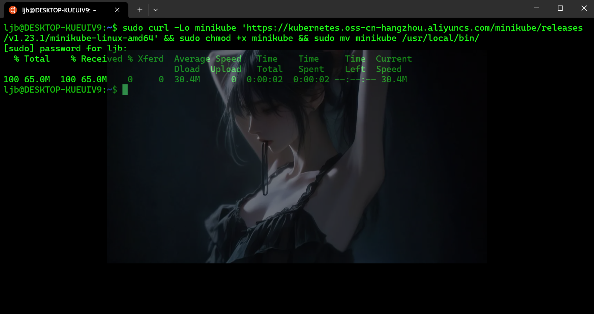
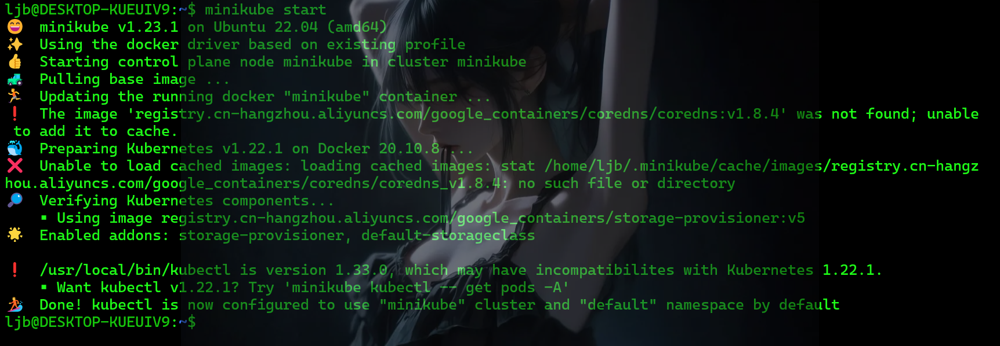
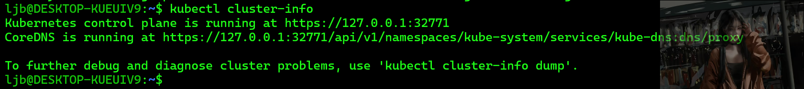
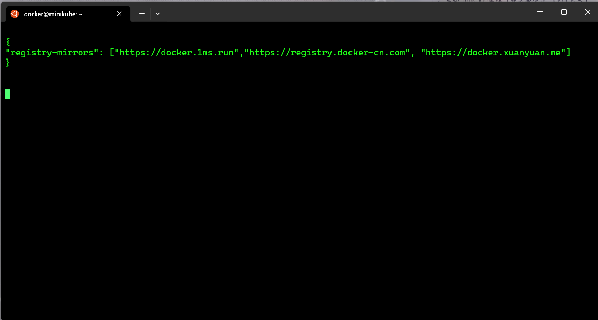
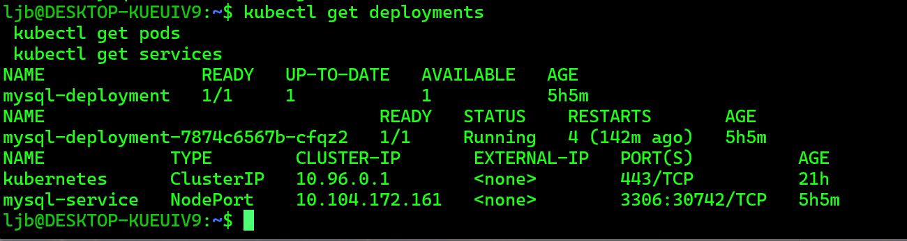
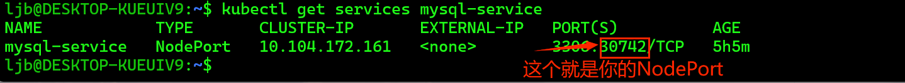
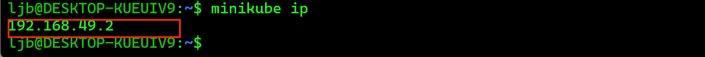
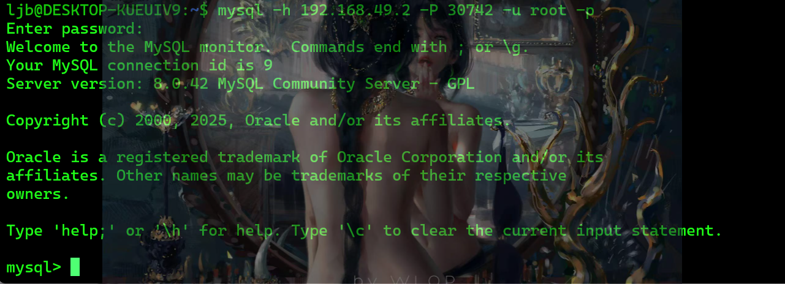

# 要求
硬件要求，找一个虚拟机，需要：

- 2 CPUs or more
- 2GB of free memory
- 20GB of free disk space

可以试试使用windows wsl 安装的ubuntu。
wsl教程：[windows安装Linux子系统](/windows/windows安装Linux子系统)
其他的你可能需要安装docker
[docker安装](/docker/Docker安装)

# 1. 安装minikube
输入
```bash
sudo curl -Lo minikube 'https://kubernetes.oss-cn-hangzhou.aliyuncs.com/minikube/releases/v1.23.1/minikube-linux-amd64' && sudo chmod +x minikube && sudo mv minikube /usr/local/bin/
```

##  1.2 启动minikube集群（默认会使用docker容器）
```bash
minikube start
```
 
让minikube下载kubectl客户端命令工具:  
```bash
minikube kubectl -- get po -A
```


启动成功后，可以通过以下命令验证集群状态：
```bash
kubectl cluster-info
```

# 2. 部署MySQL容器

经验： 因为docker默认的镜像仓库访问不到，需要设置代理，所以可以先到minikube里面去设置docker的mirror：
```bash
minikube ssh
```
进入minikube，然后：
```bash
sudo vi /etc/docker/daemon.json
```
输入：
```js
{
"registry-mirrors": ["https://docker.1ms.run","https://registry.docker-cn.com", "https://docker.xuanyuan.me"]
}
```




然后输入完成，按`Esc`键输入`:wq`回车就能保存成功
重启docker:
```bash
sudo systemctl restart docker
```

再输入`exit`退出ssh

另外如果已经创建了pod，也可以删掉它(一般可以忽略)：
`kubectl delete pod <pod-name>`
`kubectl get pods` 时，会重建


创建一个 MySQL 的部署和服务的 YAML 文件，例如 mysql-deployment.yaml：
使用以下命令部署 MySQL：

创建文件mysql-deployment.yaml：
```bash
cat << EOF > mysql-deployment.yaml
apiVersion: apps/v1
kind: Deployment
metadata:
  name: mysql-deployment
spec:
  replicas: 1
  selector:
    matchLabels:
      app: mysql
  template:
    metadata:
      labels:
        app: mysql
    spec:
      containers:
      - name: mysql
        image: mysql:8.0
        env:
        - name: MYSQL_ROOT_PASSWORD
          value: "123456" #介个系mysql密码
        ports:
        - containerPort: 3306
        volumeMounts:
        - name: mysql-persistent-storage
          mountPath: /var/lib/mysql
      volumes:
      - name: mysql-persistent-storage
        emptyDir: {}

---
apiVersion: v1
kind: Service
metadata:
  name: mysql-service
spec:
  selector:
    app: mysql
  ports:
    - protocol: TCP
      port: 3306
      targetPort: 3306
  type: NodePort
EOF
```
然后再输入他开始部署：
```bash
kubectl apply -f mysql-deployment.yaml
```


可以通过以下命令检查部署状态：
```bash
kubectl get deployments

kubectl get pods

kubectl get services
```


## 2.1 登录到MySQL数据库

### 2.1.1 获取 MySQL 服务的 NodePort
```bash
kubectl get services mysql-service
```

找到 PORT(S) 列中的端口号，例如 3306:32XXX/TCP，其中 32XXX 就是 NodePort。


### 2.1.2 获取minikube的ip
```bash
minikube ip
```


### 2.1.3 安装 MySQL 官方客户端
```bash
sudo apt update
sudo apt install mysql-client-core-8.0
```
### 2.1.4使用 mysql 客户端登录到 MySQL 数据库
**eg:**
```
#不要盲目复制
#这里的minikube ip 和NodePort我们已经获取了
mysql -h $(minikube ip) -P <NodePort> -u root -p
```



输入之前设置的密码 `123456` 登录。

##  2.2 进行数据库操作

下面是一个使用 MySQL 进行数据库和表的创建，以及增删查改操作的示例。

### 2.2.1 创建数据库

```sql
-- 创建一个名为 testdb 的数据库
CREATE DATABASE IF NOT EXISTS testdb;
-- 使用 testdb 数据库
USE testdb;
```

### 2.2.2 创建表


```sql
-- 创建一个名为 users 的表
CREATE TABLE IF NOT EXISTS users (
    id INT AUTO_INCREMENT PRIMARY KEY,
    name VARCHAR(50) NOT NULL,
    age INT
);
```

### 2.2.3 插入数据（增）


```sql
-- 向 users 表中插入一条数据
INSERT INTO users (name, age) VALUES ('John Doe', 25);
```

### 2.2.4 查询数据（查）


```sql
-- 查询 users 表中的所有数据
SELECT * FROM users;
```

### 2.2.5 更新数据（改）


```sql
-- 将 id 为 1 的用户的年龄更新为 26
UPDATE users SET age = 26 WHERE id = 1;
```
### 2.2.6 删除数据（删）


```sql
-- 删除 id 为 1 的用户
DELETE FROM users WHERE id = 1;
```

你可以按照以上步骤在 MySQL 中执行这些操作


----

***End***
