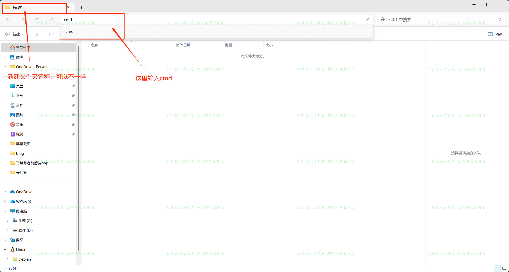
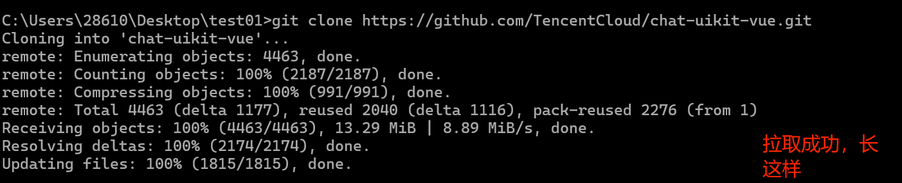
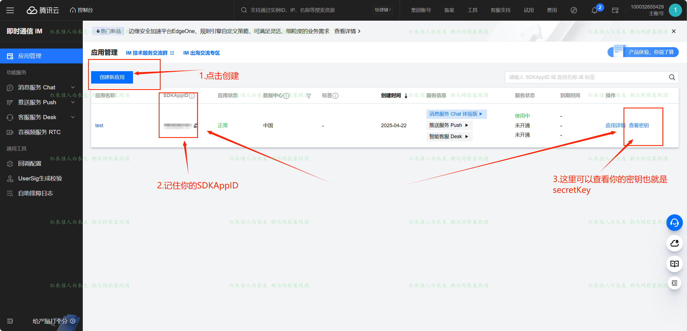
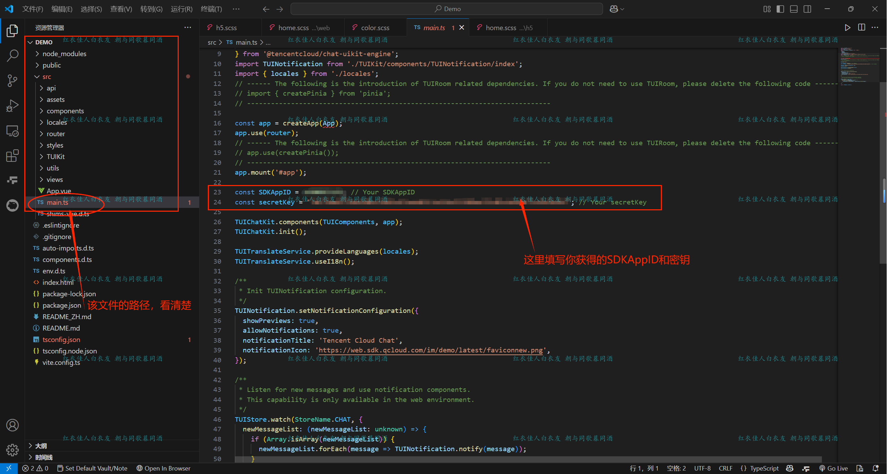
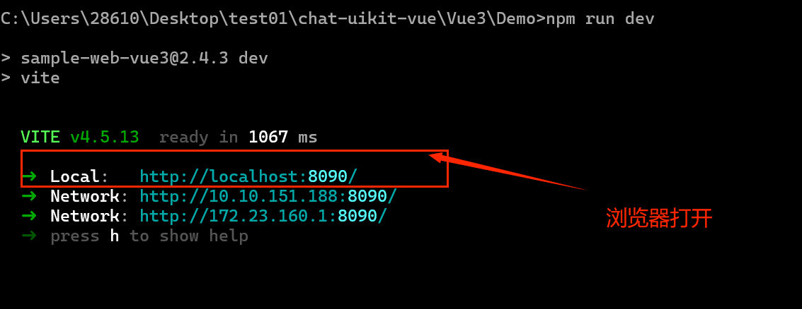
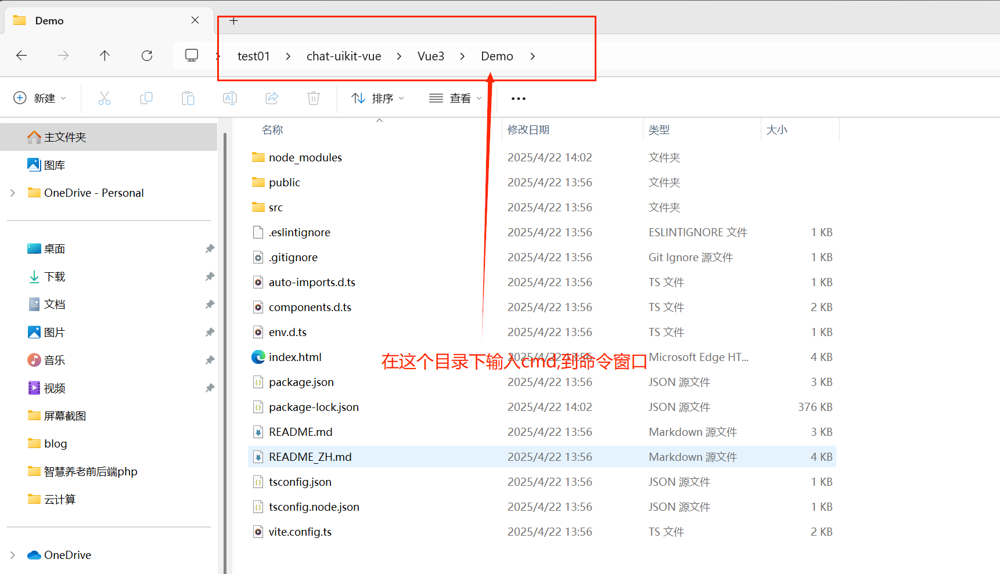
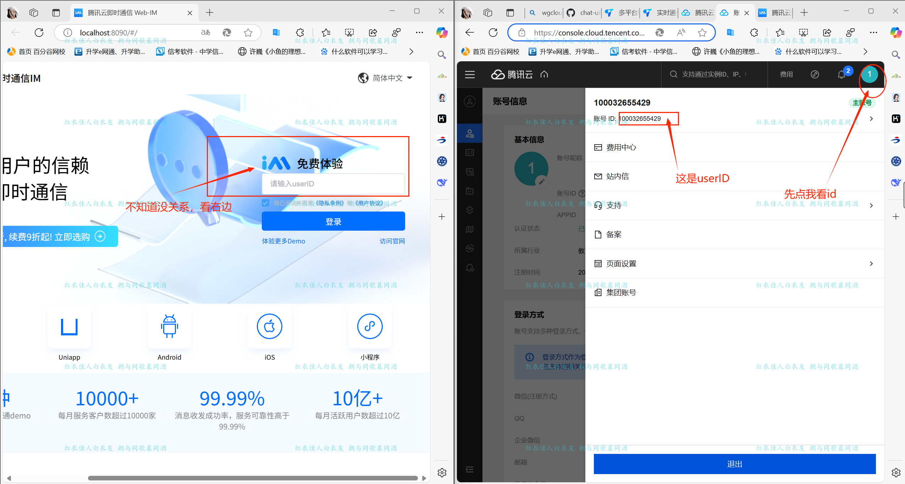
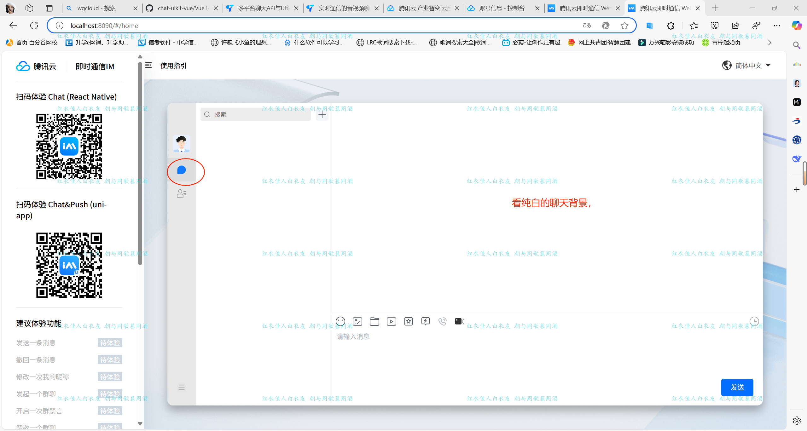
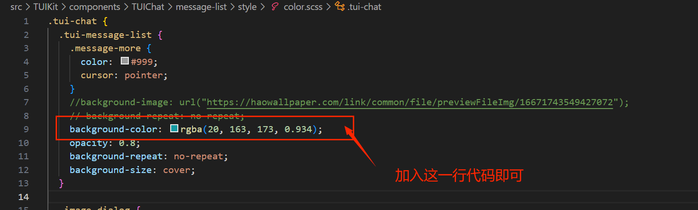
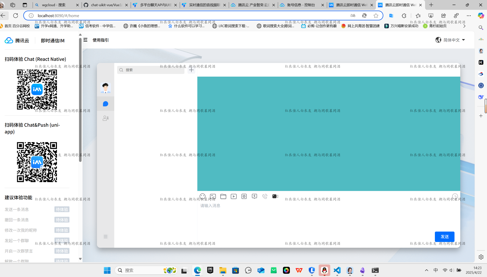

首先需要安装node.js
没安装，不教你

## 部署项目

1.拉取项目

建议拉取前先创个文件夹
然后再该文件夹顶端输入cmd
到命令行窗口复制代码拉取项目并配置依赖（ps:最好一行一行复制，因为有些人第一行命令就失败了，第一行如果拉取失败，最好挂个梯子）

```bash
git clone https://github.com/TencentCloud/chat-uikit-vue.git

cd chat-uikit-vue/Vue3/Demo

npm i --legacy-peer-deps
```
PS：用它拉取`git clone https://github.com/TencentCloud/chat-uikit-vue.git`


2.获取 SDKAppID 与 secretKey
然后[应用管理 - 即时通信 IM - 控制台](https://console.cloud.tencent.com/im)点击该链接跳转
创建一个应用获取 SDKAppID 与 secretKey



3.将你获得的密钥等填入

在项目中找到Demo\src\main.ts
编辑器打开它填写自己的SDKAppID 与 secretKey


4.启动项目
返回cmd命令窗口（你最好没有关掉它）
4.1假如你没关掉
直接在命令行里输入
```bash
npm run dev
```

4.2假如你关掉了

然后再cmd窗口输入
```bash
npm run dev
```

然后浏览器打开
进入到登录界面，其userID就是你账户id
[应用管理 - 即时通信 IM - 控制台](https://console.cloud.tencent.com/im)进去点击右上角你的头像即可




## 修改聊天背景
进去后我们发现聊天背景，太纯洁了，

想修改成自定义背景，来来来
上教程

1.修改文件
按照这个路径找到这个color.scss文件修改它
Demo\src\TUIKit\components\TUIChat\message-list\style\color.scss

2.看
修改完记得保存，然后返回发现变蓝了

