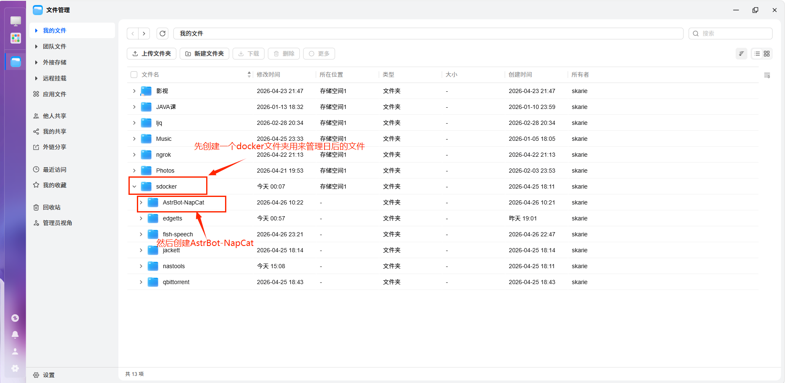
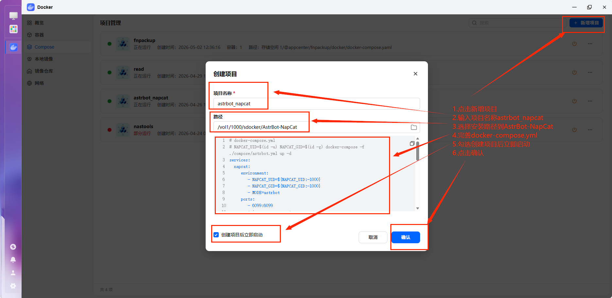
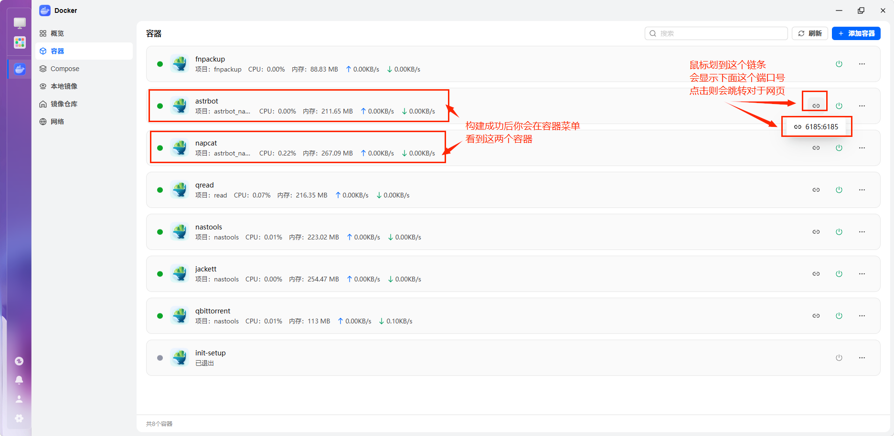
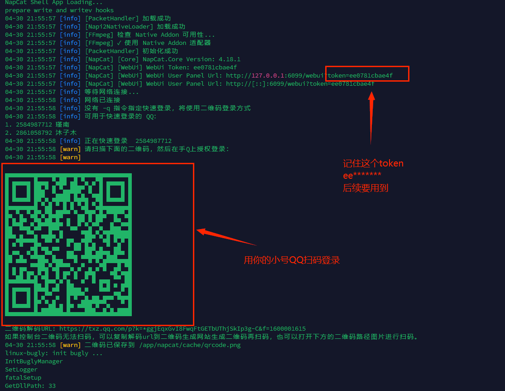
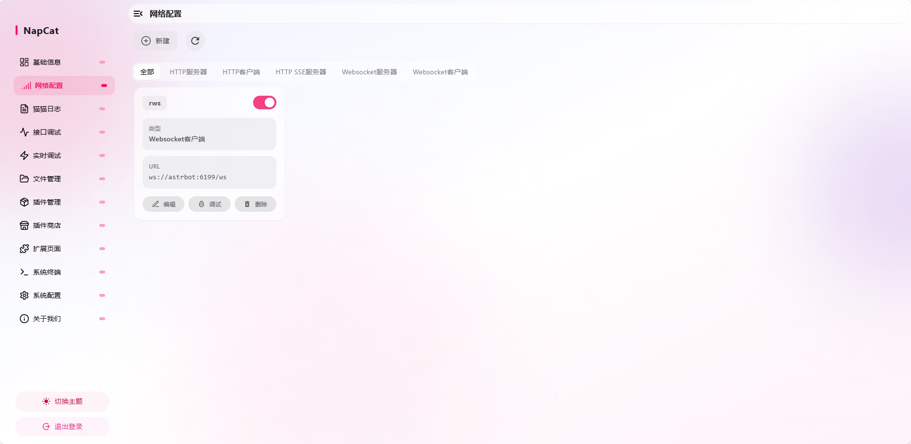
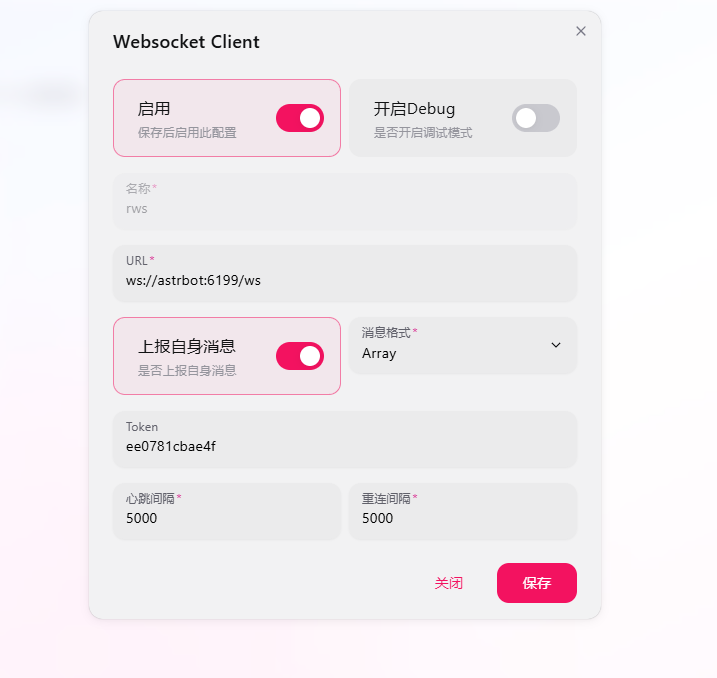
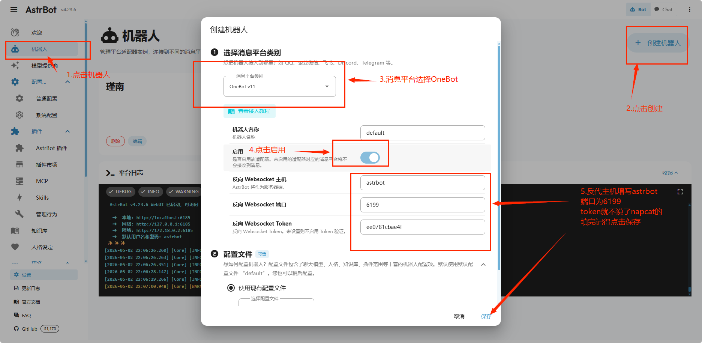

本文档详细介绍在飞牛系统上通过 Docker 一键部署 **AstrBot + NapCat** 的完整流程，帮助新手快速搭建 QQ 机器人服务。

---
## 一、部署前准备

### 1. 环境要求

- **系统**: 飞牛 OS
- **容器环境**: 已安装并启动 Docker
- **网络**: 可正常访问互联网
- **QQ 账号**: 备用 QQ 小号（不建议使用主号）
---
## 二、部署文件配置

### 1. 创建项目文件夹

创建项目目录结构：

sdocker/                                    # Docker 项目总目录(这里你可以命名为docker)
└── AstrBot-NapCat/          # 本项目目录
    ├── docker-compose.yml  # 编排文件
    ├── data/                          # AstrBot 数据
    ├── napcat/config/          # NapCat 配置
    └── ntqq/                         # QQ 登录信息
    
> 可根据实际情况调整路径，下图示例使用 `vol1/1000/sdocker/AstrBot-NapCat`


### 2. 创建 Docker Compose 项目

1. 打开 Docker 管理界面，点击侧边栏 **Compose**

2. 点击右上角 **新增项目**

3. 填写配置：
   - **项目名称**: `astrbot_napcat`
   - **项目路径**: `vol1/1000/sdocker/AstrBot-NapCat`（选择实际路径）

4. 在编辑器中粘贴以下 `docker-compose.yml` 内容：

```yaml
# docker-compose.yml
# NAPCAT_UID=$(id -u) NAPCAT_GID=$(id -g) docker-compose -f ./compose/astrbot.yml up -d
services:
  napcat:
    environment:
      - NAPCAT_UID=${NAPCAT_UID:-1000}
      - NAPCAT_GID=${NAPCAT_GID:-1000}
      - MODE=astrbot
    ports:
      - 6099:6099
    container_name: napcat
    restart: always
    image: mlikiowa/napcat-docker:latest
    volumes:
      - ./data:/AstrBot/data
      - ./napcat/config:/app/napcat/config
      - ./ntqq:/app/.config/QQ
    networks:
      - astrbot_network
    #mac_address: "02:42:ac:11:00:02"
  astrbot:
    environment:
      - TZ=Asia/Shanghai
    image: soulter/astrbot:latest
    container_name: astrbot
    restart: always
    ports:
      - "6185:6185"
      #- "6195:6195"
      #- "6199:6199"
    volumes:
      - ./data:/AstrBot/data
    networks:
      - astrbot_network
networks:
  astrbot_network:
    driver: bridge
```

5. 勾选 **创建项目后立即启动**

6. 点击 **确认**



---
## 三、登录与配置

### 1. 访问管理页面

部署完成后，在容器页面可看到 `astrbot` 和 `napcat` 两个容器：

- **AstrBot**: `http://<IP>:6185` — 机器人主控制台

- **NapCat**: `http://<IP>:6099` — QQ 协议端管理界面  

也可直接点击容器列表中的快捷链接打开。



### 2. 配置 NapCat

#### 2.1 获取登录 Token

通过 SSH 连接飞牛系统（需先在 **设置 → 系统设置 → SSH** 中开启），执行：

```bash

sudo docker logs -f napcat

```

查看日志获取：

- **WebUI Token**（用于登录 NapCat 管理界面，很重要）

- **二维码**（用于 QQ 扫码登录）

```bash
04-30 21:55:57 [info] [NapCat] [WebUi] WebUi Token: ee0781cbae4f

04-30 21:55:57 [info] [NapCat] [WebUi] WebUi User Panel Url: http://[::]:6099/webui?token=ee0781cbae4f
```



#### 2.2 登录并配置网络

1. 访问 `http://<IP>:6099/webui`并输入token

2. 使用 QQ 小号扫描二维码完成登录

3. 进入 **网络配置** → 点击 **编辑**



4. 填写配置：
   - **URL**: `ws://astrbot:6199/ws`
   - **Token**: 自定义 Token（与 AstrBot 配置保持一致）
   - **心跳间隔**: `5000`
   - **重连间隔**: `5000`

5. 点击 **保存**



### 3. 配置 AstrBot

1. 访问 `http://<IP>:6185`，输入默认账号密码登录

2. 进入 **机器人** 菜单 → **创建机器人**

3. 填写配置：
   - **消息平台**: `OneBot`
   - **机器人名称**: 自定义
   - **启用**: ✅ 勾选
   - **反向 WebSocket 主机**: `astrbot`
   - **反向 WebSocket 端口**: `6199`
   - **Access Token**: 与 NapCat 配置的 Token 保持一致

4. 点击 **保存**



---
## 四、部署完成

至此，AstrBot + NapCat 机器人部署完成。现在可以向 QQ 小号发送消息测试机器人响应。
### 常见问题

- **NapCat 无法连接**: 检查 `ws://astrbot:6199/ws` 配置是否正确
- **Token 验证失败**: 确保 NapCat 和 AstrBot 的 Token 一致
- **容器无法启动**: 检查端口 6185、6099 是否被占用
### 常用命令
```bash
# 查看容器日志
sudo docker logs -f astrbot
sudo docker logs -f napcat
# 重启服务
sudo docker restart astrbot napcat
```